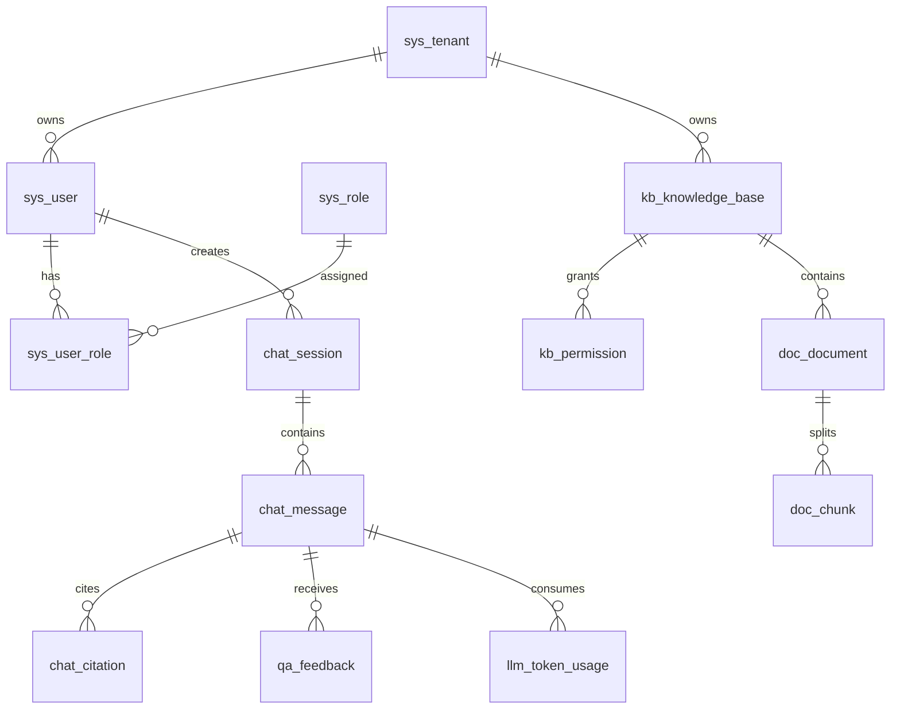

# 文档信息

- 文档名称：DATA_MODEL.md
- 当前状态：已完成
- 最近更新阶段：data-designer
- 最近更新原因：根据用户确认将主数据库更新为 MySQL 8.0

# 数据设计概述

主数据库使用 MySQL 8.0，承载租户、用户、权限、知识库、文档元数据、会话、引用、模型配置、Prompt 模板、Token 用量、反馈和审计日志。向量数据不存入 MySQL，独立使用 Milvus / Qdrant 承载 Embedding 向量和向量检索元数据。所有业务表遵循 `.ai_rules/DB_STYLE.md`：snake_case 命名、审计字段、软删除、状态字段、必要索引和租户隔离。

通用字段：

| 字段 | 类型 | 含义 |
| --- | --- | --- |
| `id` | bigint | 主键 |
| `tenant_id` | bigint | 租户 ID，平台级表可为空或为 0 |
| `create_by` | varchar(64) | 创建人 |
| `create_time` | datetime | 创建时间 |
| `update_by` | varchar(64) | 更新人 |
| `update_time` | datetime | 更新时间 |
| `is_deleted` | tinyint(1) | 软删除标识，0 未删除，1 已删除 |
| `version` | int | 乐观锁版本 |

# 核心实体列表

## ENTITY-1 `sys_tenant` 租户表

| 字段 | 类型 | 含义 |
| --- | --- | --- |
| `id` | bigint | 租户 ID |
| `tenant_code` | varchar(64) | 租户编码，唯一 |
| `tenant_name` | varchar(128) | 租户名称 |
| `status` | varchar(32) | 状态：ACTIVE、DISABLED |
| `quota_token_monthly` | bigint | 月 Token 配额 |
| `quota_storage_bytes` | bigint | 存储配额 |
| `expire_time` | datetime | 到期时间 |

索引建议：唯一索引 `uk_tenant_code(tenant_code)`；普通索引 `idx_tenant_status(status)`。

## ENTITY-2 `sys_user` 用户表

| 字段 | 类型 | 含义 |
| --- | --- | --- |
| `id` | bigint | 用户 ID |
| `tenant_id` | bigint | 租户 ID |
| `username` | varchar(64) | 登录名 |
| `password_hash` | varchar(255) | 密码哈希 |
| `display_name` | varchar(128) | 显示名 |
| `dept_id` | bigint | 部门 ID |
| `email` | varchar(128) | 邮箱 |
| `mobile_masked` | varchar(64) | 脱敏手机号 |
| `status` | varchar(32) | ACTIVE、LOCKED、DISABLED |
| `last_login_time` | datetime | 最近登录时间 |

索引建议：唯一索引 `uk_user_tenant_username(tenant_id, username)`；索引 `idx_user_tenant_dept(tenant_id, dept_id)`。

## ENTITY-3 `sys_role` 角色表

| 字段 | 类型 | 含义 |
| --- | --- | --- |
| `id` | bigint | 角色 ID |
| `tenant_id` | bigint | 租户 ID |
| `role_code` | varchar(64) | 角色编码 |
| `role_name` | varchar(128) | 角色名称 |
| `role_type` | varchar(32) | PLATFORM_ADMIN、TENANT_ADMIN、KB_ADMIN、USER |
| `status` | varchar(32) | 状态 |

索引建议：唯一索引 `uk_role_tenant_code(tenant_id, role_code)`。

## ENTITY-4 `sys_user_role` 用户角色关系表

| 字段 | 类型 | 含义 |
| --- | --- | --- |
| `id` | bigint | 主键 |
| `tenant_id` | bigint | 租户 ID |
| `user_id` | bigint | 用户 ID |
| `role_id` | bigint | 角色 ID |

索引建议：唯一索引 `uk_user_role(tenant_id, user_id, role_id)`；索引 `idx_role_user(tenant_id, role_id)`。

## ENTITY-5 `kb_knowledge_base` 知识库表

| 字段 | 类型 | 含义 |
| --- | --- | --- |
| `id` | bigint | 知识库 ID |
| `tenant_id` | bigint | 租户 ID |
| `name` | varchar(128) | 知识库名称 |
| `description` | varchar(512) | 描述 |
| `category_id` | bigint | 分类 ID |
| `visibility_type` | varchar(32) | PUBLIC、PRIVATE、DEPT、ROLE |
| `embedding_model_code` | varchar(64) | Embedding 模型编码 |
| `retrieval_config_json` | json | 检索配置 |
| `document_count` | int | 文档数 |
| `chunk_count` | int | Chunk 数 |
| `status` | varchar(32) | ACTIVE、DISABLED |

索引建议：唯一索引 `uk_kb_tenant_name(tenant_id, name)`；索引 `idx_kb_tenant_status(tenant_id, status)`。

## ENTITY-6 `kb_permission` 知识库权限表

| 字段 | 类型 | 含义 |
| --- | --- | --- |
| `id` | bigint | 主键 |
| `tenant_id` | bigint | 租户 ID |
| `knowledge_base_id` | bigint | 知识库 ID |
| `subject_type` | varchar(32) | USER、ROLE、DEPT |
| `subject_id` | bigint | 授权主体 ID |
| `permission_type` | varchar(32) | READ、WRITE、ADMIN |
| `status` | varchar(32) | ACTIVE、DISABLED |

索引建议：唯一索引 `uk_kb_permission(tenant_id, knowledge_base_id, subject_type, subject_id, permission_type)`；索引 `idx_permission_subject(tenant_id, subject_type, subject_id)`。

## ENTITY-7 `doc_document` 文档表

| 字段 | 类型 | 含义 |
| --- | --- | --- |
| `id` | bigint | 文档 ID |
| `tenant_id` | bigint | 租户 ID |
| `knowledge_base_id` | bigint | 知识库 ID |
| `file_name` | varchar(255) | 原始文件名 |
| `file_type` | varchar(32) | PDF、DOCX、MD、TXT、XLSX、HTML |
| `content_type` | varchar(128) | MIME 类型 |
| `file_size` | bigint | 文件大小 |
| `storage_bucket` | varchar(128) | MinIO bucket |
| `storage_object_key` | varchar(512) | MinIO object key |
| `checksum` | varchar(128) | 文件摘要，幂等和去重 |
| `document_version` | int | 文档版本 |
| `status` | varchar(32) | UPLOADED、PARSING、PARSED、EMBEDDING、INDEXED、FAILED、DELETED |
| `error_code` | varchar(64) | 失败编码 |
| `error_message` | varchar(1024) | 失败原因 |
| `parsed_time` | datetime | 解析完成时间 |
| `indexed_time` | datetime | 索引完成时间 |

索引建议：索引 `idx_doc_tenant_kb_status(tenant_id, knowledge_base_id, status)`；唯一索引 `uk_doc_tenant_checksum_version(tenant_id, checksum, document_version)`。

## ENTITY-8 `doc_chunk` 文档 Chunk 表

| 字段 | 类型 | 含义 |
| --- | --- | --- |
| `id` | bigint | Chunk ID |
| `tenant_id` | bigint | 租户 ID |
| `knowledge_base_id` | bigint | 知识库 ID |
| `document_id` | bigint | 文档 ID |
| `document_version` | int | 文档版本 |
| `chunk_no` | int | Chunk 序号 |
| `parent_chunk_id` | bigint | Parent Chunk ID |
| `title_path` | varchar(512) | 标题路径 |
| `content` | text | Chunk 正文 |
| `content_hash` | varchar(128) | 内容摘要 |
| `page_no` | int | 页码 |
| `token_count` | int | Token 数 |
| `vector_id` | varchar(128) | 向量库 ID |
| `search_doc_id` | varchar(128) | 搜索引擎文档 ID |
| `metadata_json` | json | 权限、页码、表格、标题等元数据 |
| `status` | varchar(32) | ACTIVE、DELETED |

索引建议：索引 `idx_chunk_doc(tenant_id, document_id, document_version)`；索引 `idx_chunk_kb_status(tenant_id, knowledge_base_id, status)`；唯一索引 `uk_chunk_doc_no(tenant_id, document_id, document_version, chunk_no)`。

## ENTITY-9 `chat_session` 会话表

| 字段 | 类型 | 含义 |
| --- | --- | --- |
| `id` | bigint | 会话 ID |
| `tenant_id` | bigint | 租户 ID |
| `user_id` | bigint | 用户 ID |
| `title` | varchar(255) | 会话标题 |
| `knowledge_base_ids` | varchar(512) | 会话关联知识库 ID 列表 |
| `summary` | text | 会话摘要 |
| `status` | varchar(32) | ACTIVE、ARCHIVED |
| `last_message_time` | datetime | 最近消息时间 |

索引建议：索引 `idx_session_user_time(tenant_id, user_id, last_message_time)`。

## ENTITY-10 `chat_message` 消息表

| 字段 | 类型 | 含义 |
| --- | --- | --- |
| `id` | bigint | 消息 ID |
| `tenant_id` | bigint | 租户 ID |
| `session_id` | bigint | 会话 ID |
| `user_id` | bigint | 用户 ID |
| `role` | varchar(32) | USER、ASSISTANT、SYSTEM |
| `question` | text | 用户问题 |
| `rewritten_question` | text | 改写问题 |
| `answer` | text | 模型回答 |
| `confidence` | varchar(32) | HIGH、MEDIUM、LOW |
| `refusal_reason` | varchar(64) | 拒答原因 |
| `trace_id` | varchar(128) | 链路 ID |
| `status` | varchar(32) | SUCCESS、FAILED、REFUSED |

索引建议：索引 `idx_message_session(tenant_id, session_id, create_time)`；索引 `idx_message_trace(trace_id)`。

## ENTITY-11 `chat_citation` 引用来源表

| 字段 | 类型 | 含义 |
| --- | --- | --- |
| `id` | bigint | 引用 ID |
| `tenant_id` | bigint | 租户 ID |
| `message_id` | bigint | 消息 ID |
| `document_id` | bigint | 文档 ID |
| `chunk_id` | bigint | Chunk ID |
| `citation_no` | int | 引用序号 |
| `document_name` | varchar(255) | 文档名快照 |
| `page_no` | int | 页码 |
| `quote_text` | text | 引用摘要 |
| `score` | decimal(10,6) | 检索 / Rerank 分数 |

索引建议：索引 `idx_citation_message(tenant_id, message_id)`；索引 `idx_citation_doc(tenant_id, document_id)`。

## ENTITY-12 `llm_model_config` 模型配置表

| 字段 | 类型 | 含义 |
| --- | --- | --- |
| `id` | bigint | 模型配置 ID |
| `tenant_id` | bigint | 租户 ID，平台默认模型可为 0 |
| `provider` | varchar(64) | OpenAI、AzureOpenAI、DeepSeek、Qwen、Zhipu、Local |
| `model_code` | varchar(64) | 内部模型编码 |
| `model_name` | varchar(128) | 供应商模型名 |
| `model_type` | varchar(32) | CHAT、EMBEDDING、RERANK |
| `endpoint` | varchar(512) | API 地址 |
| `api_key_cipher` | text | 加密 API Key |
| `timeout_ms` | int | 超时时间 |
| `max_tokens` | int | 最大输出 Token |
| `price_config_json` | json | 价格配置 |
| `status` | varchar(32) | ACTIVE、DISABLED |

索引建议：唯一索引 `uk_model_tenant_code(tenant_id, model_code)`；索引 `idx_model_type_status(tenant_id, model_type, status)`。

## ENTITY-13 `prompt_template` Prompt 模板表

| 字段 | 类型 | 含义 |
| --- | --- | --- |
| `id` | bigint | Prompt 模板 ID |
| `tenant_id` | bigint | 租户 ID |
| `prompt_code` | varchar(64) | Prompt 编码 |
| `prompt_name` | varchar(128) | Prompt 名称 |
| `version_no` | varchar(32) | 版本号 |
| `scenario` | varchar(64) | 场景：RAG_QA、QUERY_REWRITE、SUMMARY |
| `template_content` | text | 模板正文 |
| `variables_json` | json | 变量契约 |
| `status` | varchar(32) | DRAFT、ACTIVE、DISABLED |

索引建议：唯一索引 `uk_prompt_code_version(tenant_id, prompt_code, version_no)`；索引 `idx_prompt_scenario_status(tenant_id, scenario, status)`。

## ENTITY-14 `llm_token_usage` Token 用量表

| 字段 | 类型 | 含义 |
| --- | --- | --- |
| `id` | bigint | 用量 ID |
| `tenant_id` | bigint | 租户 ID |
| `user_id` | bigint | 用户 ID |
| `session_id` | bigint | 会话 ID |
| `message_id` | bigint | 消息 ID |
| `model_code` | varchar(64) | 模型编码 |
| `provider` | varchar(64) | 供应商 |
| `prompt_tokens` | int | 输入 Token |
| `completion_tokens` | int | 输出 Token |
| `total_tokens` | int | 总 Token |
| `cost_amount` | decimal(18,6) | 成本金额 |
| `currency` | varchar(16) | 币种 |
| `operation_type` | varchar(32) | CHAT、EMBEDDING、RERANK |
| `trace_id` | varchar(128) | 链路 ID |

索引建议：索引 `idx_usage_tenant_time(tenant_id, create_time)`；索引 `idx_usage_user_time(tenant_id, user_id, create_time)`；索引 `idx_usage_model_time(model_code, create_time)`。

## ENTITY-15 `qa_feedback` 反馈表

| 字段 | 类型 | 含义 |
| --- | --- | --- |
| `id` | bigint | 反馈 ID |
| `tenant_id` | bigint | 租户 ID |
| `user_id` | bigint | 用户 ID |
| `session_id` | bigint | 会话 ID |
| `message_id` | bigint | 消息 ID |
| `feedback_type` | varchar(32) | LIKE、DISLIKE、REPORT |
| `score` | int | 评分 1-5 |
| `reason_tags` | varchar(512) | 原因标签 |
| `comment` | text | 反馈内容 |
| `status` | varchar(32) | OPEN、RESOLVED、IGNORED |

索引建议：索引 `idx_feedback_message(tenant_id, message_id)`；索引 `idx_feedback_status_time(tenant_id, status, create_time)`。

## ENTITY-16 `audit_log` 审计日志表

| 字段 | 类型 | 含义 |
| --- | --- | --- |
| `id` | bigint | 审计 ID |
| `tenant_id` | bigint | 租户 ID |
| `user_id` | bigint | 用户 ID |
| `operation` | varchar(128) | 操作类型 |
| `resource_type` | varchar(64) | 资源类型 |
| `resource_id` | bigint | 资源 ID |
| `request_uri` | varchar(512) | 请求地址 |
| `request_method` | varchar(16) | 请求方法 |
| `client_ip` | varchar(64) | 客户端 IP |
| `result_status` | varchar(32) | SUCCESS、FAILED、DENIED |
| `error_message` | varchar(1024) | 错误摘要 |
| `trace_id` | varchar(128) | 链路 ID |

索引建议：索引 `idx_audit_tenant_time(tenant_id, create_time)`；索引 `idx_audit_resource(tenant_id, resource_type, resource_id)`；索引 `idx_audit_trace(trace_id)`。

# 实体关系



# 数据一致性要求

- 文档元数据写入 DB 和原文件写入 MinIO 之间需要补偿：MinIO 成功但 DB 失败时清理对象；DB 成功但 MQ 投递失败时由定时任务补偿。
- 文档状态流转必须幂等，状态只允许按状态机推进。
- Chunk、向量库和搜索引擎索引通过 `document_id + document_version + chunk_no` 保持一致。
- 文档删除采用软删除 + 异步清理索引；引用历史保留文档名和引用快照。
- Token 用量由 LLM Gateway 统一落库，业务服务不直接计算供应商价格。

# 向量库元数据设计

每条向量至少保存：

```json
{
  "tenant_id": 1,
  "knowledge_base_id": 10,
  "document_id": 100,
  "document_version": 3,
  "chunk_id": 9001,
  "chunk_no": 12,
  "status": "ACTIVE",
  "visibility_type": "ROLE",
  "allow_user_ids": [1, 2],
  "allow_role_ids": [10, 11],
  "allow_dept_ids": [100],
  "page_no": 5,
  "title_path": "售后政策/换货规则"
}
```

检索时必须将 `tenant_id`、`knowledge_base_id`、`status` 和权限元数据作为 Filter 条件。

# 数据风险与注意事项

- `allow_user_ids` 等 ACL 元数据在向量库中过大会影响检索性能，生产可改为“粗过滤 + DB 二次校验”或权限位图。
- `chat_message.answer` 可能很长，必要时冷热分离或归档。
- `audit_log`、`llm_token_usage` 增长快，需要按月分区或归档。
- API Key 必须加密存储，不允许明文入库。
- 日志和反馈内容可能包含敏感信息，入库前需脱敏。
