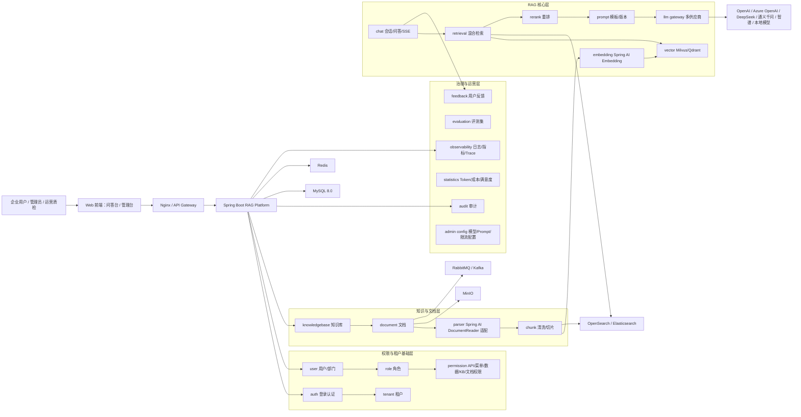
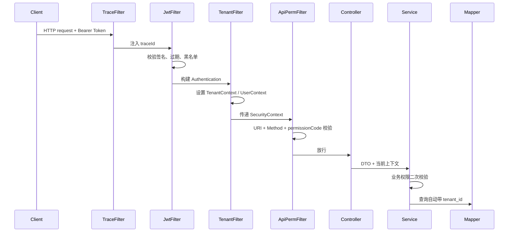
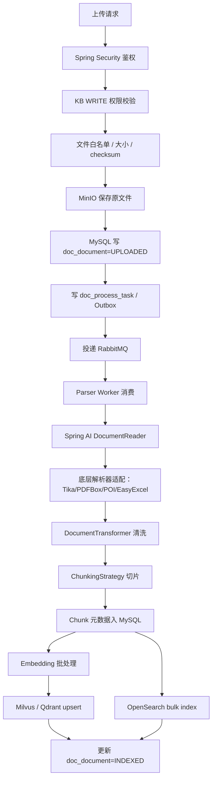
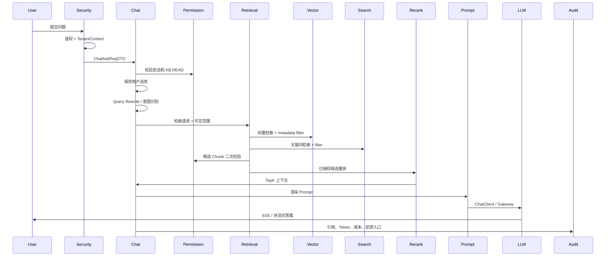
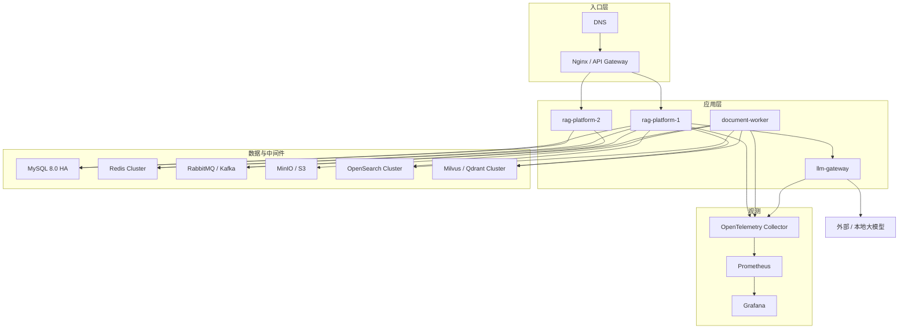

# 文档信息

- 文档名称：DESIGN.md
- 当前状态：已完成
- 最近更新阶段：system-architect / task-planner 合并设计入口
- 最近更新原因：合并 `MICROSERVICE_DESIGN.md` 中仍有效的微服务演进内容，统一模块化单体 MVP 与 C 方案绞杀者式微服务演进口径

# 0. 设计依据与规则门禁

本设计基于以下已确认事实生成：

- 当前任务为 `enterprise_rag_platform_design`，属于 L4 长期 / 跨模块 / AI 架构设计任务。
- 当前仓库尚无业务源码、SQL 脚本和可执行测试，因此本文不虚构既有调用链；所有实现路径均为目标架构设计。
- 已通过 Design Research Gate，推荐方案为“模块化单体优先，生产按能力拆分”，不采用“业务代码直接调用模型 API”的 Demo 式方案。
- 已确认技术栈：Java 17+、Spring Boot 3.x、Spring Security、MyBatis-Plus、MySQL 8.0、Redis、MinIO、RabbitMQ 生产可演进 Kafka、OpenSearch / Elasticsearch、Milvus / Qdrant、Spring AI、统一 LLM Gateway、Docker Compose、Nginx、Prometheus + Grafana + OpenTelemetry。
- 本轮合并后，`02_design/DESIGN.md` 是唯一总体设计主入口；`02_design/MICROSERVICE_DESIGN.md` 仅保留为历史迁移说明，不再作为主设计入口。
- 微服务生产演进采用 C 方案：绞杀者式渐进拆分；MVP / 第一阶段实现主线仍是模块化单体，不直接创建全量微服务工程。
- 第一阶段微服务拆分时只先拆 `auth-service` 和 `audit-service`；不单独拆 `tenant-service`，不单独拆 `iam-service`。
- 租户、用户、部门、角色、权限、权限快照、租户配置、租户配额、服务间鉴权先合并进 `auth-service`。后续当 IAM / tenant 能力复杂化、需要独立团队维护或被多个系统复用时，再从 `auth-service` 拆出独立 `iam-service` 或 `tenant-service`。

本设计必须遵守的 `.ai_rules` 约束：

- API：统一 `/api/v1/`，RESTful，DTO 入参出参，统一返回结构，接口必须鉴权并返回 `traceId`。
- DB：MySQL 表和字段使用 snake_case；业务表必须包含 `id`、`tenant_id`、审计字段、软删除、状态、版本和必要索引。
- 分层：未来 Java 代码按 `controller / service / service.impl / dao.entity / dao.mapper / dto.req / dto.res / dto.common` 分层；Controller 不直接访问 Mapper，不直接返回 Entity。
- Service：必须 interface + impl；写操作事务边界放在 Service impl；外部模型、MQ、对象存储和索引调用通过专门 Service 或 Gateway 封装。
- 日志：结构化日志必须包含 `traceId`、`tenantId`、`userId`、`bizId`、`operation`、`costMs`，禁止打印 Token、密码、API Key、原始密钥和完整个人敏感信息。
- 注释：public 类、public 方法、DTO 字段、复杂状态机和权限规则必须有中文注释或 OpenAPI 注解。

# 1. 项目定位

## 1.1 解决的问题

企业内部知识通常分散在制度文档、产品手册、研发规范、接口文档、售后 FAQ、故障复盘、运维 SOP、流程说明和历史邮件中。传统搜索系统能找到文档，但不能替用户完成理解、归纳、对比和追溯；通用大模型能表达，但不知道企业私有知识，也不知道用户是否有权读取某份资料。

企业级 RAG 知识库问答平台要解决四类问题：

1. 知识获取效率：让员工从“查文档列表”变成“直接问问题并获得可追溯答案”。
2. 知识可信度：回答必须基于授权资料，带引用来源，不能凭模型记忆编造。
3. 权限治理：同一个问题对不同租户、部门、角色和用户可能得到不同可见范围的答案。
4. AI 工程治理：模型调用、Prompt、Token 成本、日志审计、限流、降级和评估不能散落在业务代码中。

## 1.2 适用企业场景

- 企业制度和流程问答：报销、请假、采购、合同、审批、合规制度。
- 客服和售后知识助手：产品 FAQ、故障处理、退换货、保修政策。
- 研发知识助手：接口文档、部署说明、编码规范、故障复盘、架构设计。
- 运维知识助手：告警处理、巡检 SOP、发布回滚、应急预案。
- 售前和交付知识库：方案模板、标书素材、客户案例、行业资料。
- 培训和新人上手：把分散文档变成可问答的内部导师。

## 1.3 关键词搜索 vs RAG

| 维度 | 关键词搜索 | 企业级 RAG |
| --- | --- | --- |
| 输出 | 文档列表、片段、高亮 | 自然语言答案、引用来源、置信度 |
| 依赖 | 用户自己阅读判断 | 系统检索、重排、归纳、生成 |
| 适合问题 | 精确词、编号、标题、错误码 | 口语化问题、跨文档归纳、上下文追问 |
| 权限处理 | 返回结果前过滤 | 检索前、召回中、生成前、引用返回前多层过滤 |
| 可追溯性 | 依赖用户点开文档 | 回答中强制绑定 chunk、文档、页码和版本 |
| 风险 | 搜不到或搜太多 | 幻觉、越权、Prompt Injection、成本失控，需要工程治理 |

本平台不废弃关键词搜索，而是把 OpenSearch / Elasticsearch 的 BM25 召回与 Milvus / Qdrant 的语义召回合并，再通过 Rerank 和权限校验形成可信上下文。

## 1.4 为什么不用纯 Fine-tuning

纯 Fine-tuning 不适合作为企业知识问答主路径：

- 企业知识更新频繁，Fine-tuning 更新成本高、周期长，难以及时吸收最新制度和文档。
- Fine-tuning 难以保证回答来自某份文档，更难输出页码、段落和版本引用。
- Fine-tuning 无法天然解决“同一问题不同用户不同权限”的答案差异。
- Fine-tuning 更适合学习回答风格、格式、任务模式，不适合作为可审计知识事实库。
- 企业合规场景要求可撤回、可删除、可追溯，RAG 通过索引删除和引用快照更容易治理。

推荐定位：Fine-tuning 可作为后续增强项，用于统一风格、分类模型或小模型重排；企业知识事实仍以 RAG 检索上下文为准。

## 1.5 企业为什么需要权限型 RAG

企业文档不是公开语料。财务制度、客户资料、报价方案、人事流程、研发接口、运维密钥说明、故障报告都有访问边界。如果 RAG 只做向量检索，不做权限过滤，就可能通过相似问题召回无权限 Chunk，最终在答案或引用中泄露敏感资料。

权限型 RAG 的核心原则：

- 用户能看到什么，模型才能看到什么。
- 检索结果有权限，生成答案才有资格使用。
- 引用来源必须再次校验，不能因为答案已生成就直接展示。
- 权限是数据设计、索引设计、检索设计、Prompt 设计和审计设计的共同约束，不是 Controller 上的一个注解。

# 2. 总体架构

## 2.1 MVP 模块化单体架构

MVP 采用一个 Spring Boot 3.x 应用，内部按领域包拆分模块。单体不等于无边界：每个领域只暴露 Service interface，基础设施通过 adapter / gateway 封装，异步文档处理通过 MQ 解耦，模型供应商通过 LLM Gateway 隔离。

MVP 进程内模块：

- `auth / tenant / user / role / permission`：身份、租户、用户、部门、角色、权限和上下文。
- `knowledgebase / document / parser / chunk`：知识库、文档上传、解析、清洗、切片和状态机。
- `embedding / vector / retrieval / rerank`：Embedding、向量库、关键词索引、混合检索和重排。
- `prompt / chat / llm`：Prompt 模板、RAG 问答、会话、流式输出和模型网关。
- `feedback / evaluation / audit / statistics / observability / adminconfig`：反馈、评估、审计、统计、可观测和后台配置。
- `common / config`：统一响应、异常、枚举、上下文、拦截器、数据源、Redis、MQ、MinIO、安全和观测配置。

MVP 基础设施：

- MySQL 8.0：关系数据、权限、元数据、会话、引用、用量、审计。
- Redis：登录态辅助、权限缓存、限流、热点问题缓存、会话摘要缓存。
- MinIO：原始文件和导出文件。
- RabbitMQ：文档解析、Embedding、索引重建、审计异步落库。
- OpenSearch / Elasticsearch：关键词索引、BM25、过滤、高亮。
- Milvus / Qdrant：向量存储、ANN 检索和权限元数据过滤。
- Prometheus + Grafana + OpenTelemetry：指标、看板和 Trace。

## 2.2 生产微服务演进架构

生产阶段采用 C 方案：绞杀者式渐进拆分。拆分顺序由真实负载、团队边界、SLA、复用压力和数据增长驱动，不以“一开始看起来像微服务”为目标。

当前生产演进服务清单收敛为 14 个服务：

| 服务 | 拆分阶段 | 主要职责 |
| --- | --- | --- |
| `auth-service` | 第一批 | 认证、租户、用户、部门、角色、权限、权限快照、租户配置、租户配额、服务间鉴权 |
| `audit-service` | 第一批 | 审计事件采集、审计查询、风险审计、归档 |
| `kb-service` | 第二批 | 知识库元数据、分类、KB ACL、检索配置 |
| `document-service` | 第二批 | 文档上传、元数据、版本、状态机、文档 ACL、MinIO 对象归属 |
| `document-worker` | 第三批 | 文档解析、清洗、切片、索引任务编排、失败重试 |
| `embedding-service` | 第三批 | Query / Chunk Embedding 批处理、模型调用编排、维度校验 |
| `llm-gateway-service` | 第四批 | 模型供应商唯一出口、路由、API Key 解密、限流、熔断、Token 和成本原始记录 |
| `prompt-service` | 第四批 | Prompt 模板、版本、变量契约、渲染、灰度、回滚 |
| `retrieval-service` | 第五批 | 授权混合检索、向量检索、关键词检索、Rerank、候选权限二次校验 |
| `rag-chat-service` | 第五批 | 会话、问答编排、SSE、引用落库、回答状态管理 |
| `feedback-service` | 第六批 | 用户反馈、问题标注、反馈处理流转 |
| `evaluation-service` | 第六批 | 评测集、评测任务、RAG 回归、质量评分 |
| `statistics-service` | 第六批 | Token、成本、文档、问答、反馈、评测统计聚合 |
| `admin-config-service` | 第六批 | 管理后台聚合入口，负责配置编排，不拥有其他服务数据真相 |

第一阶段不维护独立 `tenant-service` 和 `iam-service`。二者作为未来演进选项，仅在以下条件出现后再从 `auth-service` 拆出：

- IAM 权限模型复杂化，需要独立团队维护。
- 租户治理、套餐计费、跨系统租户管理或运营能力显著复杂化。
- 用户、部门、角色、权限、租户能力需要被多个系统复用。
- SSO / LDAP / OAuth2 等企业身份集成超出 RAG 平台自身节奏。

## 2.3 完整关系图



## 2.4 模块依赖方向

允许依赖方向：

```text
controller -> service -> dao.mapper -> dao.entity
domain service -> infrastructure adapter
chat -> retrieval -> vector/search
chat -> prompt -> llm gateway
document -> parser -> chunk -> embedding -> vector/search
business module -> permission service -> tenant/user/role
business module -> audit/statistics as side effect
```

禁止依赖方向：

```text
controller -> mapper
controller -> entity as response
retrieval/chat -> supplier SDK directly
document/parser -> chat
llm gateway -> business module
dao -> service
prompt template hardcode scattered in chat service
```

## 2.5 哪些模块先单体，哪些后续拆服务

MVP / 第一阶段仍按模块化单体实施：

- `auth / tenant / user / role / permission` 在单体内保持清晰包边界和 Service interface，作为未来 `auth-service` 的候选边界。
- `knowledgebase / document / parser / chunk` 在单体内闭环知识库和文档处理能力。
- `embedding / vector / retrieval / rerank / prompt / chat / llm` 在单体内验证 RAG 效果，但必须从第一天封装 `LlmGateway` 和 `PromptService` 接口。
- `feedback / evaluation / audit / statistics / observability / adminconfig` 先做基础能力，避免影响核心链路。

生产演进顺序：

1. 冻结模块边界和契约：先建立 OpenAPI、事件、错误码、上下文头、Outbox / Inbox / consume log 标准。
2. 先拆 `auth-service` 和 `audit-service`：`auth-service` 合并 tenant / IAM 能力，成为权限、租户、服务间鉴权的统一入口。
3. 再拆 `kb-service`、`document-service`：知识库元数据、KB ACL、文档上传、文档 ACL、状态机独立。
4. 再拆 `document-worker`、`embedding-service`：解析、清洗、切片、Embedding、索引构建异步化和独立扩容。
5. 再拆 `llm-gateway-service`、`prompt-service`：模型调用、成本、安全治理和 Prompt 版本化从业务服务剥离。
6. 再拆 `retrieval-service`、`rag-chat-service`：检索和问答分别扩容，Chat 只负责编排。
7. 最后拆 `feedback-service`、`evaluation-service`、`statistics-service`、`admin-config-service`：质量运营、统计和后台配置独立迭代。

# 3. 权限与多租户设计

权限、多租户和数据隔离是平台基础能力，必须先于知识库、文档、RAG、模型网关实现。后续所有业务表、索引、缓存、日志、Trace 和模型调用都必须带上 `tenantId` 与 `userId` 上下文。

## 3.1 租户模型

租户表示企业、组织、客户或业务隔离单元。租户之间默认强隔离。

核心表：

- `sys_tenant`：租户编码、名称、状态、到期时间、Token 配额、存储配额。
- `sys_tenant_config`：租户级默认模型、默认向量库、默认检索策略、限流策略、敏感词策略。
- `sys_tenant_quota`：按月 Token、存储、文档数量、并发限制。

关键规则：

- 普通业务表必须包含 `tenant_id`。
- 平台级配置可使用 `tenant_id = 0` 表示全局默认，租户级配置覆盖全局配置。
- 租户状态为 `DISABLED` 或过期时，除平台管理员外，拒绝登录、上传、问答和索引任务。
- 租户配额超限时，允许查询历史数据，但限制高成本模型调用、文档上传和批量 Embedding。

## 3.2 用户模型

核心表：

- `sys_user`：用户账号、密码哈希、显示名、部门、邮箱、脱敏手机号、状态。
- `sys_user_role`：用户角色关系。
- `sys_user_token`：刷新 Token、设备、过期时间、撤销状态。
- `sys_login_log`：登录成功、失败、锁定、IP、User-Agent、traceId。

关键规则：

- 用户名在租户内唯一。
- 密码只保存哈希，禁止明文和可逆加密。
- 用户被禁用后，刷新 Token 失效，访问 Token 在短过期窗口后自然失效；高安全场景可通过 Redis 黑名单即时失效。
- 用户查询自己的会话和反馈；管理员基于数据权限查看审计范围。

## 3.3 部门模型

核心表：

- `sys_dept`：部门树，包含 `parent_id`、`ancestors`、`dept_path`、`status`。
- `sys_user.dept_id`：用户所属部门。

关键规则：

- 部门用于知识库可见范围、文档 ACL、数据权限和统计维度。
- 数据权限支持本人、本部门、本部门及子部门、指定部门、全部租户数据。
- 部门树变更后，权限缓存必须失效；搜索和向量元数据可采用粗粒度部门 ID + DB 二次校验，避免频繁重建全部向量。

## 3.4 角色模型

角色分为平台角色和租户角色：

- 平台管理员：管理租户、全局模型、平台配置、跨租户审计；默认不直接查看租户私有文档正文，除非获得授权。
- 租户管理员：管理本租户用户、部门、角色、知识库、模型配额和统计。
- 知识库管理员：管理被授权知识库的文档、权限、索引和配置。
- 普通用户：在授权知识库范围内问答、查看自己的会话和提交反馈。
- 运营 / 质检：维护评测集、查看脱敏问答和反馈数据。

核心表：

- `sys_role`：角色编码、角色类型、状态。
- `sys_user_role`：用户角色。
- `sys_role_permission`：角色与权限点关系。

## 3.5 权限模型

权限分层：

| 层级 | 权限对象 | 示例 | 校验位置 |
| --- | --- | --- | --- |
| 菜单权限 | 前端菜单、按钮 | 模型管理、租户管理 | 登录后返回前端权限树 |
| API 权限 | 后端接口 | `/api/v1/models`、`/api/v1/documents/upload` | Spring Security Filter + Method Security |
| 数据权限 | 租户、部门、本人、指定范围 | 只看本部门会话 | MyBatis-Plus 拦截器 + Service 校验 |
| 知识库权限 | KB READ / WRITE / ADMIN | 可读售后知识库 | PermissionService |
| 文档权限 | 文档级 ACL / 继承 KB | 某文档只给法务 | 文档 Service、检索过滤、引用校验 |
| 会话权限 | 会话归属和管理范围 | 用户只看自己会话 | Chat Service |
| 引用来源权限 | citation 的 document/chunk 可见性 | 引用返回前二次过滤 | Chat Citation Service |

核心表：

- `sys_permission`：权限点，包含 `permission_code`、`permission_type`、`resource_pattern`。
- `sys_menu`：菜单、按钮、前端路由。
- `sys_role_permission`：角色授权。
- `sys_data_scope`：角色或用户的数据范围。
- `kb_permission`：知识库授权。
- `doc_permission`：文档级授权。

## 3.6 菜单权限

菜单权限只决定前端展示，不作为后端安全唯一依据。登录后后端返回菜单树和按钮权限，前端据此隐藏入口；后端仍必须通过 API 权限和数据权限校验。

示例：

- 平台管理员：租户管理、全局模型管理、全局审计。
- 租户管理员：用户管理、角色管理、知识库管理、租户用量。
- 知识库管理员：知识库详情、文档上传、重建索引。
- 普通用户：问答、会话、反馈。

## 3.7 API 权限

API 权限由 Spring Security 负责入口拦截：

1. `TraceIdFilter` 生成或接收 `traceId`。
2. `JwtAuthenticationFilter` 解析 Bearer Token。
3. `TenantResolveFilter` 设置 `TenantContext`。
4. `SecurityContext` 写入 `LoginUserPrincipal`，包含 `tenantId`、`userId`、`deptId`、`roleIds`、`permissionCodes`。
5. `ApiPermissionFilter` 基于 URI、Method 和权限码校验。
6. `@PreAuthorize` 用于高风险方法的二次防护。

禁止客户端传入 `tenantId` 覆盖服务端上下文；平台管理员跨租户操作必须显式调用平台管理 API，并写审计日志。

## 3.8 数据权限

数据权限用于 MySQL 查询、统计和后台列表，不解决文档检索全部问题，但必须作为基础防线。

实现方式：

- `TenantContextHolder`：ThreadLocal 保存当前 `tenantId`、`userId`、`deptId`、`roleIds`。
- `DataScopeContext`：保存当前接口或 Service 的数据范围。
- MyBatis-Plus TenantLineInnerInterceptor：为租户业务表自动注入 `tenant_id = ?`。
- 自定义 DataPermissionInterceptor：为用户、部门、本人范围注入额外条件。
- Service 层二次校验：对详情、删除、重建索引等高风险操作不能只依赖列表 SQL 拦截。

例外表必须白名单声明，例如 `sys_tenant`、全局字典、平台模型默认配置；白名单必须经过代码审查。

## 3.9 知识库权限

知识库权限是 RAG 可见范围的第一道业务边界：

- `READ`：可在问答中选择知识库，可查看授权文档和引用。
- `WRITE`：可上传、删除、重建索引文档。
- `ADMIN`：可修改知识库配置、授权用户/角色/部门。

授权主体：

- USER：指定用户。
- ROLE：指定角色。
- DEPT：指定部门。
- TENANT：租户内公开知识库。

读取知识库列表时，普通用户只能看到有 READ 权限的知识库；租户管理员可看本租户全部知识库；平台管理员默认只管理租户资源，不直接越权读取文档正文。

## 3.10 文档权限

文档默认继承知识库权限；需要更严格控制时，使用文档级 ACL 覆盖或收紧。

核心规则：

- 文档上传时必须指定权限模式：`INHERIT_KB`、`CUSTOM`、`PRIVATE`。
- 文档级权限不能扩大到超过知识库管理员允许的范围，除非租户管理员授权。
- 文档删除、重建索引、下载原文必须校验 WRITE 或 ADMIN 权限。
- 引用展示前必须校验文档仍可见；如果文档被删除或权限收紧，历史引用只展示脱敏快照或拒绝查看原文。

## 3.11 会话权限

会话默认归属创建用户：

- 普通用户只能查看自己的会话。
- 租户管理员可查看本租户脱敏会话统计和审计，不默认查看敏感正文。
- 运营质检可查看进入评测集或已脱敏的问答样本。
- 删除用户时，会话可保留为审计数据，但前端不可继续展示给该用户。

会话中的知识库范围必须在每次问答时重新校验，不能因为会话创建时有权限就永久有效。

## 3.12 引用来源权限

引用来源权限是 RAG 最容易遗漏的环节。保存引用时记录 `tenant_id`、`message_id`、`document_id`、`chunk_id`、`document_version`、`quote_text` 快照；展示引用时必须：

1. 校验当前用户是否仍有文档 READ 权限。
2. 校验文档状态不是 `DELETED`。
3. 校验 `chunk_id` 属于同租户、同知识库。
4. 如果权限已失效，只展示“引用来源已不可访问”，不返回正文和文件下载链接。

## 3.13 Spring Security 鉴权链路



异常处理：

- Token 无效：`401001`。
- API 无权限：`403001`。
- 数据越权：`403001`，写审计日志 `DENIED`。
- 租户禁用：`403001` 或 `401001`，视发生在登录前还是登录后。

## 3.14 JWT / Token 设计

Access Token：

- 短有效期，建议 30 分钟。
- 包含 `tenantId`、`userId`、`deptId`、`roleIds`、`tokenVersion`、`jti`。
- 不放敏感权限明细和 API Key。
- 使用非对称签名或服务端密钥签名，生产支持密钥轮换。

Refresh Token：

- 长有效期，建议 7-30 天。
- 服务端存储哈希或 token id，支持撤销。
- 用户改密、禁用、角色变更时可提升 `tokenVersion` 使旧 Token 失效。

Redis 用途：

- Token 黑名单。
- 用户权限版本缓存。
- 登录失败计数。
- 租户 / 用户限流计数。

## 3.15 SecurityContext / TenantContext 设计

核心对象：

- `LoginUserPrincipal`：`tenantId`、`userId`、`username`、`deptId`、`roleIds`、`permissionCodes`、`dataScopes`。
- `TenantContext`：当前租户、是否平台态、请求来源、租户配置快照。
- `UserContext`：当前用户、部门、角色、请求 IP。
- `TraceContext`：traceId、spanId、requestId。

清理规则：

- 所有 ThreadLocal 必须在 Filter finally 中清理。
- MQ 消费时从消息 Header 恢复 `tenantId`、`traceId` 和触发用户。
- 异步线程必须使用上下文装饰器传递，禁止直接读取父线程 ThreadLocal。

## 3.16 多租户数据隔离策略

| 数据类型 | 隔离策略 | 说明 |
| --- | --- | --- |
| MySQL 业务表 | 共享库共享表 + `tenant_id` | MVP 默认；配合拦截器和索引 |
| MinIO 文件 | bucket 可共享，object key 包含 `tenant/{tenantId}/kb/{kbId}/doc/{docId}` | 防止路径冲突，便于迁移 |
| OpenSearch 索引 | 可按环境共享索引，文档带 `tenant_id` | 大租户可独立 index |
| Milvus / Qdrant | collection 可共享，payload / metadata 带 `tenant_id` | 大租户可独立 collection |
| Redis 缓存 | key 前缀包含租户 | `rag:{tenantId}:...` |
| 日志和 Trace | 字段包含 tenantId | 用于排障和成本归属 |

高隔离企业可演进为独立库、独立对象桶、独立索引和独立向量 collection。

## 3.17 MySQL 查询如何强制带 tenant_id

实现组合：

1. 表设计层：所有业务表含 `tenant_id`，联合索引优先以 `tenant_id` 开头。
2. ORM 层：MyBatis-Plus `TenantLineInnerInterceptor` 自动改写 SQL。
3. Mapper 层：禁止 `select *`；自定义 SQL 必须显式带租户条件。
4. Service 层：详情、更新、删除先按 `id + tenant_id` 查询。
5. 测试层：架构规则测试扫描 Mapper XML 和注解 SQL，检查危险 SQL。
6. Review 层：`.ai_rules/DB_STYLE.md` 合规审查。

不能只依赖拦截器，因为复杂 SQL、子查询、批量更新和白名单表可能绕过自动注入。

## 3.18 向量库如何保存权限元数据

向量 payload / metadata 至少包含：

```json
{
  "tenant_id": 1,
  "knowledge_base_id": 10,
  "document_id": 100,
  "document_version": 3,
  "chunk_id": 9001,
  "chunk_no": 12,
  "status": "ACTIVE",
  "visibility_type": "ROLE",
  "allow_user_ids": [1001],
  "allow_role_ids": [2001, 2002],
  "allow_dept_ids": [3001],
  "permission_revision": 18,
  "page_no": 5,
  "title_path": "售后政策/换货规则"
}
```

MVP 可以直接写入 ACL 数组；生产如 ACL 过大，采用粗过滤：`tenant_id + knowledge_base_id + status + permission_revision`，检索后回 MySQL 批量二次校验。

## 3.19 检索时如何避免越权

检索权限分四层：

1. 检索前：根据用户权限计算可见 `knowledgeBaseIds` 和可见文档范围，用户传入的知识库 ID 必须取交集。
2. 检索中：向量库和 OpenSearch Filter 必须带 `tenant_id`、`knowledge_base_id`、`status=ACTIVE` 和权限元数据。
3. 检索后：对候选 `chunk_id` 批量查询 MySQL，使用 PermissionService 二次校验文档权限。
4. 生成前和引用前：只把已授权 Chunk 拼入 Prompt；答案引用展示前再次校验。

默认拒绝策略：权限服务异常、上下文缺失、ACL 无法判断时，检索结果视为不可用。

## 3.20 管理员差异

| 角色 | 可做 | 不可做 |
| --- | --- | --- |
| 平台管理员 | 管理租户、全局模型、平台参数、跨租户资源状态和脱敏审计 | 默认不读取租户私有文档正文和用户私有会话 |
| 租户管理员 | 管理本租户用户、部门、角色、知识库、模型配置、统计 | 不跨租户访问，不绕过文档级 ACL |
| 知识库管理员 | 管理授权知识库文档、索引、权限和配置 | 不管理租户用户全局权限，不访问未授权知识库 |
| 普通用户 | 授权范围内问答、查看自己的会话、提交反馈 | 不上传无权限知识库，不看他人会话，不看无权限引用 |

# 4. 核心领域模块设计

## 4.1 模块总览

| 模块 | 主要职责 | 上游依赖 | 下游依赖 |
| --- | --- | --- | --- |
| auth | 登录、Token、认证上下文 | user、tenant | Spring Security、Redis |
| tenant | 租户、配额、配置 | 无 | 全业务模块 |
| user | 用户、部门 | tenant | auth、permission |
| role | 角色、角色授权 | tenant、permission | auth |
| permission | API、菜单、数据、KB、文档权限 | tenant、user、role | 全业务模块 |
| knowledgebase | 知识库聚合根 | permission | document、retrieval |
| document | 上传、元数据、状态机、版本 | knowledgebase、permission | parser、MQ、MinIO |
| parser | Spring AI 文档 ETL 和解析器适配 | document | chunk |
| chunk | 清洗、切片、Chunk 元数据 | parser | embedding、vector、search |
| embedding | 文本向量化 | llm gateway / Spring AI | vector |
| vector | Milvus / Qdrant 封装 | embedding | retrieval |
| retrieval | 混合检索、权限过滤 | vector、search、permission | rerank、chat |
| rerank | 重排 | retrieval、llm gateway | chat |
| prompt | Prompt 模板、版本、渲染 | admin config | chat、llm gateway |
| chat | 会话、问答、SSE、引用 | retrieval、prompt、llm | feedback、audit、statistics |
| llm gateway | 模型供应商统一封装 | admin config | 外部模型 |
| feedback | 用户反馈 | chat、permission | evaluation |
| evaluation | 评测集和评分 | feedback、chat | statistics |
| audit | 审计日志 | 全业务模块 | statistics |
| statistics | Token、成本、满意度、报表 | llm、chat、feedback | admin |
| observability | 日志、指标、Trace | 全模块 | Prometheus、Grafana、OTel |
| admin config | 模型、Prompt、限流、敏感词 | permission | llm、prompt、tenant |

## 4.2 模块详细设计矩阵

### auth

| 项目 | 设计 |
| --- | --- |
| 模块职责 | 登录认证、密码校验、Access Token / Refresh Token、Token 撤销、登录失败限流、SecurityContext 构建 |
| 不负责什么 | 不管理知识库权限细节，不直接读取文档，不做业务数据过滤 |
| 核心类 | `JwtAuthenticationFilter`、`LoginUserPrincipal`、`PasswordEncoderConfig`、`SecurityExceptionHandler` |
| 核心 Service | `AuthService`、`TokenService`、`LoginLogService` |
| 核心表 | `sys_user`、`sys_user_token`、`sys_login_log` |
| 核心 API | `POST /api/v1/auth/login`、`POST /api/v1/auth/refresh`、`POST /api/v1/auth/logout` |
| 状态流转 | Token：`ACTIVE -> REVOKED -> EXPIRED`；用户登录失败计数：`NORMAL -> LOCKED` |
| 异常场景 | 租户禁用、用户禁用、密码错误、Token 过期、Token 黑名单、权限版本失效 |
| 日志要求 | 登录成功 info；失败 warn；暴力破解和 Token 异常 warn；禁止打印密码、Token 原文 |
| 权限要求 | 登录接口匿名；退出和刷新需有效 Token；平台态切换必须平台管理员 |
| 测试要点 | 密码错误锁定、Token 过期、Token 撤销、租户禁用、SecurityContext 字段完整 |

### tenant

| 项目 | 设计 |
| --- | --- |
| 模块职责 | 租户生命周期、租户状态、配额、租户级默认配置、资源隔离策略 |
| 不负责什么 | 不保存用户密码，不直接处理文档解析 |
| 核心类 | `TenantContextHolder`、`TenantResolveFilter`、`TenantQuotaChecker` |
| 核心 Service | `TenantService`、`TenantConfigService`、`TenantQuotaService` |
| 核心表 | `sys_tenant`、`sys_tenant_config`、`sys_tenant_quota` |
| 核心 API | `GET /api/v1/admin/tenants`、`POST /api/v1/admin/tenants`、`PUT /api/v1/admin/tenants/{tenantId}` |
| 状态流转 | `INIT -> ACTIVE -> DISABLED -> EXPIRED` |
| 异常场景 | 租户编码重复、租户过期、配额不足、禁用租户仍有任务执行 |
| 日志要求 | 租户创建、启停、配额调整记录审计；日志带平台管理员 userId |
| 权限要求 | 仅平台管理员创建租户；租户管理员只能看本租户配置 |
| 测试要点 | 租户隔离、配额超限、禁用租户拒绝问答和上传 |

### user

| 项目 | 设计 |
| --- | --- |
| 模块职责 | 用户 CRUD、部门树、用户状态、用户角色绑定、个人信息脱敏 |
| 不负责什么 | 不签发 Token，不直接判断 KB ACL |
| 核心类 | `UserStatusEnum`、`DeptTreeBuilder`、`UserConverter` |
| 核心 Service | `UserService`、`DeptService` |
| 核心表 | `sys_user`、`sys_dept`、`sys_user_role` |
| 核心 API | `GET /api/v1/users`、`POST /api/v1/users`、`PUT /api/v1/users/{userId}`、`GET /api/v1/depts/tree` |
| 状态流转 | 用户：`ACTIVE -> LOCKED -> DISABLED`；部门：`ACTIVE -> DISABLED` |
| 异常场景 | 用户名重复、部门禁用、删除用户仍有审计数据、手机号邮箱敏感字段泄露 |
| 日志要求 | 创建、禁用、重置密码、角色变更写审计 |
| 权限要求 | 租户管理员管理本租户用户；普通用户只能更新部分个人信息 |
| 测试要点 | 租户内用户名唯一、跨租户不可见、禁用用户无法登录 |

### role

| 项目 | 设计 |
| --- | --- |
| 模块职责 | 角色 CRUD、角色类型、角色与权限点绑定、角色与用户绑定 |
| 不负责什么 | 不做具体接口拦截，不处理文档 ACL 继承 |
| 核心类 | `RoleTypeEnum`、`RolePermissionAssembler` |
| 核心 Service | `RoleService`、`RolePermissionService` |
| 核心表 | `sys_role`、`sys_role_permission`、`sys_user_role` |
| 核心 API | `GET /api/v1/roles`、`POST /api/v1/roles`、`PUT /api/v1/roles/{roleId}/permissions` |
| 状态流转 | `ACTIVE -> DISABLED` |
| 异常场景 | 删除角色仍被用户引用、越权授予平台权限、租户内角色编码重复 |
| 日志要求 | 授权变更必须记录 old/new permissionCodes |
| 权限要求 | 租户管理员可维护租户角色；平台角色仅平台管理员维护 |
| 测试要点 | 普通管理员不能授予超出自身范围的权限 |

### permission

| 项目 | 设计 |
| --- | --- |
| 模块职责 | API 权限、菜单权限、数据权限、知识库权限、文档权限、权限缓存、权限二次校验 |
| 不负责什么 | 不保存文档正文，不执行向量检索 |
| 核心类 | `PermissionEvaluator`、`DataScopeResolver`、`KnowledgeBaseAclChecker`、`DocumentAclChecker`、`RetrievalPermissionFilter` |
| 核心 Service | `PermissionService`、`DataPermissionService`、`KnowledgeBasePermissionService`、`DocumentPermissionService` |
| 核心表 | `sys_permission`、`sys_menu`、`sys_role_permission`、`sys_data_scope`、`kb_permission`、`doc_permission` |
| 核心 API | `GET /api/v1/permissions/tree`、`PUT /api/v1/roles/{roleId}/permissions`、`PUT /api/v1/knowledge-bases/{id}/permissions` |
| 状态流转 | ACL：`ACTIVE -> DISABLED`；权限缓存：`VALID -> STALE -> REBUILT` |
| 异常场景 | 权限缓存过期、ACL 过大、权限服务异常、越权授权 |
| 日志要求 | 权限拒绝 warn；授权变更 audit；禁止输出完整 ACL 给模型 |
| 权限要求 | 权限配置接口要求管理员；业务校验默认拒绝未知权限 |
| 测试要点 | API 拦截、数据范围、KB READ/WRITE/ADMIN、文档自定义 ACL、检索二次过滤 |

### knowledgebase

| 项目 | 设计 |
| --- | --- |
| 模块职责 | 知识库创建、修改、分类、启停、检索配置、Embedding 配置、统计信息、权限配置入口 |
| 不负责什么 | 不解析文件，不直接调用模型供应商 |
| 核心类 | `KnowledgeBaseAggregate`、`RetrievalConfig`、`KnowledgeBaseStatusEnum` |
| 核心 Service | `KnowledgeBaseService`、`KnowledgeBasePermissionFacade` |
| 核心表 | `kb_knowledge_base`、`kb_permission`、`kb_category` |
| 核心 API | `GET /api/v1/knowledge-bases`、`POST /api/v1/knowledge-bases`、`PUT /api/v1/knowledge-bases/{id}` |
| 状态流转 | `DRAFT -> ACTIVE -> DISABLED -> ARCHIVED` |
| 异常场景 | 名称重复、禁用知识库仍被问答选择、修改 Embedding 模型需重建索引 |
| 日志要求 | 创建、启停、检索配置变更、权限变更记录审计 |
| 权限要求 | READ 可问答，WRITE 可上传，ADMIN 可配置 |
| 测试要点 | 租户内名称唯一、可见列表过滤、禁用知识库不可检索 |

### document

| 项目 | 设计 |
| --- | --- |
| 模块职责 | 文件上传、MinIO 存储、文档元数据、版本、状态机、删除、重建索引、MQ 投递 |
| 不负责什么 | 不直接切片，不直接生成答案 |
| 核心类 | `DocumentStatusMachine`、`DocumentUploadValidator`、`DocumentObjectKeyGenerator`、`DocumentTaskMessage` |
| 核心 Service | `DocumentService`、`DocumentTaskService`、`DocumentStorageService` |
| 核心表 | `doc_document`、`doc_permission`、`doc_process_task` |
| 核心 API | `POST /api/v1/documents/upload`、`GET /api/v1/documents/{id}/status`、`DELETE /api/v1/documents/{id}`、`POST /api/v1/documents/{id}/reindex` |
| 状态流转 | `UPLOADED -> PARSING -> PARSED -> EMBEDDING -> INDEXED`；任意处理态可到 `FAILED`；`INDEXED -> DELETED` |
| 异常场景 | 文件类型非法、大文件、MinIO 成功 DB 失败、MQ 投递失败、重复上传、重建时状态冲突 |
| 日志要求 | 上传开始/成功、状态变更、重试、失败原因；文件名脱敏或长度限制 |
| 权限要求 | 上传需 KB WRITE；删除和重建需 WRITE/ADMIN；下载需 READ |
| 测试要点 | 状态机合法性、幂等上传、非法文件拒绝、MQ 投递补偿 |

### parser

| 项目 | 设计 |
| --- | --- |
| 模块职责 | 基于 Spring AI DocumentReader / DocumentTransformer 建立文档 ETL，适配 PDF、DOCX、Markdown、TXT、Excel、HTML 等底层解析器 |
| 不负责什么 | 不决定用户权限，不调用 Chat 模型 |
| 核心类 | `DocumentParser`、`SpringAiDocumentIngestionService`、`PdfDocumentReaderAdapter`、`OfficeDocumentReaderAdapter`、`HtmlDocumentReaderAdapter` |
| 核心 Service | `DocumentParseService`、`DocumentCleanerService` |
| 核心表 | `doc_document`、`doc_process_task`、可选 `doc_parse_result` |
| 核心 API | 通常无外部 API，通过 MQ 消费；后台可有 `POST /api/v1/documents/{id}/parse/retry` |
| 状态流转 | 任务：`PENDING -> RUNNING -> SUCCESS / FAILED / DEAD` |
| 异常场景 | 加密 PDF、扫描件 OCR 不支持、表格结构丢失、解析超时、乱码 |
| 日志要求 | 解析器选择、页数、字符数、耗时、失败文件类型；禁止输出大段原文 |
| 权限要求 | 仅消费已授权上传产生的任务；任务消息必须带 tenantId |
| 测试要点 | 多格式解析、失败重试、文本清洗、页码和标题元数据保留 |

### chunk

| 项目 | 设计 |
| --- | --- |
| 模块职责 | 文本清洗、分段、Token 估算、Overlap、Parent-Child Chunk、Chunk 元数据入库 |
| 不负责什么 | 不直接访问模型供应商，不做最终检索排序 |
| 核心类 | `ChunkingStrategy`、`TitleAwareChunkingStrategy`、`TokenTextSplitter`、`ChunkMetadataBuilder` |
| 核心 Service | `ChunkService`、`ChunkMetadataService` |
| 核心表 | `doc_chunk`、`doc_chunk_relation` |
| 核心 API | 内部能力；后台可暴露切片预览 `POST /api/v1/documents/{id}/chunks/preview` |
| 状态流转 | Chunk：`ACTIVE -> DELETED`；版本：新版本生成后旧版本可归档 |
| 异常场景 | Chunk 过长、过短、重复、表格语义丢失、标题路径缺失 |
| 日志要求 | chunkCount、平均长度、最大长度、策略编码、耗时 |
| 权限要求 | Chunk 必须继承 `tenant_id`、KB、文档权限元数据 |
| 测试要点 | 长度边界、Overlap、标题路径、表格保留、重复处理幂等 |

### embedding

| 项目 | 设计 |
| --- | --- |
| 模块职责 | 调用 Spring AI EmbeddingModel 或 LLM Gateway Embedding 适配器，批量生成向量，记录 Token 和成本 |
| 不负责什么 | 不保存原始文件，不做业务权限判断 |
| 核心类 | `EmbeddingRequestBatcher`、`EmbeddingModelRouter`、`EmbeddingVectorDTO` |
| 核心 Service | `EmbeddingService`、`EmbeddingTaskService` |
| 核心表 | `llm_model_config`、`llm_token_usage`、`doc_process_task` |
| 核心 API | 内部任务；管理端可提供模型测试接口 |
| 状态流转 | 任务：`PENDING -> RUNNING -> SUCCESS / FAILED / RETRYING` |
| 异常场景 | 模型超时、限流、维度不匹配、批量过大、文本为空 |
| 日志要求 | modelCode、batchSize、dimension、tokenUsage、costMs、错误码 |
| 权限要求 | 使用租户模型配置；API Key 只在网关解密 |
| 测试要点 | 批处理、限流重试、维度校验、失败不污染索引 |

### vector

| 项目 | 设计 |
| --- | --- |
| 模块职责 | 封装 Milvus / Qdrant VectorStore，负责 upsert、search、delete、collection 初始化和权限 metadata |
| 不负责什么 | 不做 Prompt，不直接返回给用户 |
| 核心类 | `VectorStoreService`、`MilvusVectorStoreAdapter`、`QdrantVectorStoreAdapter`、`VectorMetadataMapper` |
| 核心 Service | `VectorStoreService`、`VectorIndexAdminService` |
| 核心表 | MySQL `doc_chunk.vector_id` 保存映射；向量库 collection 保存向量和 payload |
| 核心 API | 内部；后台可提供索引健康检查 |
| 状态流转 | 向量：`UPSERTED -> ACTIVE -> DELETED` |
| 异常场景 | collection 不存在、维度不匹配、批量写入部分失败、删除失败 |
| 日志要求 | collection、documentId、chunkCount、filter、latency、topK |
| 权限要求 | payload 必须带 `tenant_id`、KB、doc、ACL 元数据 |
| 测试要点 | upsert 幂等、按文档删除、metadata filter、防跨租户检索 |

### retrieval

| 项目 | 设计 |
| --- | --- |
| 模块职责 | Query Rewrite 后的向量检索、关键词检索、RRF / 加权合并、权限过滤、TopN 候选输出 |
| 不负责什么 | 不调用 Chat 模型生成最终答案 |
| 核心类 | `RetrievalService`、`HybridRetriever`、`KeywordRetriever`、`VectorRetriever`、`RetrievalPermissionFilter` |
| 核心 Service | `RetrievalService`、`SearchIndexService` |
| 核心表 | `doc_chunk`、OpenSearch index、向量 collection |
| 核心 API | 内部；可提供 `POST /api/v1/retrieval/debug` 给管理员调试 |
| 状态流转 | 检索请求无持久状态；调试记录可归档 |
| 异常场景 | 向量库不可用、搜索引擎不可用、权限服务异常、召回为空 |
| 日志要求 | queryHash、kbIds、vectorCostMs、keywordCostMs、candidateCount、filteredCount |
| 权限要求 | 检索前取可见 KB 交集，检索中 metadata filter，检索后二次校验 |
| 测试要点 | 混合召回、权限过滤、无召回、单路检索降级 |

### rerank

| 项目 | 设计 |
| --- | --- |
| 模块职责 | 对候选 Chunk 做相关性重排，减少噪声，提高引用质量 |
| 不负责什么 | 不决定用户是否登录，不保存文档正文 |
| 核心类 | `RerankService`、`RerankModelAdapter`、`ScoreNormalizer` |
| 核心 Service | `RerankService` |
| 核心表 | `llm_model_config`、`llm_token_usage`，可选 `retrieval_debug_log` |
| 核心 API | 内部；模型配置端可测试 Rerank |
| 状态流转 | 无持久状态 |
| 异常场景 | Rerank 超时、供应商失败、分数异常、候选过多 |
| 日志要求 | modelCode、candidateCount、topK、costMs、降级原因 |
| 权限要求 | 只允许对已授权候选重排，禁止把未授权 Chunk 送入模型 |
| 测试要点 | 重排顺序、超时降级、候选为空、Token 统计 |

### prompt

| 项目 | 设计 |
| --- | --- |
| 模块职责 | Prompt 模板配置、变量契约、版本管理、渲染、安全规则和回滚 |
| 不负责什么 | 不硬编码业务问答逻辑，不直接调用供应商 |
| 核心类 | `PromptTemplateService`、`PromptRenderer`、`PromptVariableValidator`、`PromptVersionManager` |
| 核心 Service | `PromptTemplateService`、`PromptRenderService` |
| 核心表 | `prompt_template`、`prompt_template_history`、`prompt_eval_case` |
| 核心 API | `POST /api/v1/prompt-templates`、`GET /api/v1/prompt-templates`、`POST /api/v1/prompt-templates/{id}/activate` |
| 状态流转 | `DRAFT -> ACTIVE -> DISABLED -> ARCHIVED` |
| 异常场景 | 变量缺失、模板语法错误、版本覆盖、Prompt Injection 规则缺失 |
| 日志要求 | promptCode、version、scenario、renderCostMs；禁止打印完整敏感上下文 |
| 权限要求 | 仅管理员维护；问答服务只读取 ACTIVE 版本 |
| 测试要点 | 变量校验、版本不可覆盖、渲染结果、拒答模板和对抗样例 |

### chat

| 项目 | 设计 |
| --- | --- |
| 模块职责 | 会话、消息、Query Rewrite、RAG 编排、非流式问答、SSE 流式输出、引用保存、拒答 |
| 不负责什么 | 不直接读写向量库，不直接调用供应商 SDK |
| 核心类 | `RagChatService`、`ChatSessionService`、`ChatMessageService`、`CitationService`、`NoAnswerPolicy` |
| 核心 Service | `RagChatService`、`ChatSessionService`、`ChatCitationService` |
| 核心表 | `chat_session`、`chat_message`、`chat_citation`、`llm_token_usage` |
| 核心 API | `POST /api/v1/chat/completions`、`POST /api/v1/chat/completions/stream`、`GET /api/v1/chat/sessions` |
| 状态流转 | 消息：`PROCESSING -> SUCCESS / FAILED / REFUSED`；会话：`ACTIVE -> ARCHIVED` |
| 异常场景 | 无答案、无权限、模型超时、客户端断开、引用失效 |
| 日志要求 | sessionId、messageId、questionHash、retrievalCount、tokenUsage、firstTokenMs |
| 权限要求 | 会话归属校验；KB READ；引用展示前二次校验 |
| 测试要点 | 无答案拒答、流式结束帧、引用保存、用户只看自己会话 |

### llm gateway

| 项目 | 设计 |
| --- | --- |
| 模块职责 | Chat、Embedding、Rerank 统一入口，供应商适配、模型路由、重试、熔断、限流、Token、成本、审计、流式协议适配、API Key 解密 |
| 不负责什么 | 不保存业务文档，不判断 KB ACL，不维护用户角色 |
| 核心类 | `LlmGateway`、`ModelRouter`、`ModelProviderAdapter`、`OpenAiAdapter`、`AzureOpenAiAdapter`、`DeepSeekAdapter`、`QwenAdapter`、`ZhipuAdapter`、`LocalModelAdapter` |
| 核心 Service | `LlmGateway`、`ModelConfigService`、`ApiKeyCryptoService`、`TokenUsageService` |
| 核心表 | `llm_model_config`、`llm_token_usage`、`llm_call_log` |
| 核心 API | `GET /api/v1/models`、`POST /api/v1/models`、`POST /api/v1/models/{id}/test` |
| 状态流转 | 模型配置：`DRAFT -> ACTIVE -> DISABLED`；调用：`STARTED -> SUCCESS / FAILED / DEGRADED` |
| 异常场景 | API Key 无效、供应商超时、限流、模型不存在、流式中断、成本计算失败 |
| 日志要求 | provider、modelCode、operationType、tokenUsage、costAmount、costMs、traceId；API Key 脱敏 |
| 权限要求 | 模型配置仅管理员；业务调用通过内部 Service，不暴露密钥 |
| 测试要点 | 路由、降级、超时、重试、Token 统计、SSE 适配、密钥加解密 |

### feedback

| 项目 | 设计 |
| --- | --- |
| 模块职责 | 点赞、点踩、评分、标签、文本反馈、反馈状态 |
| 不负责什么 | 不直接修改答案，不直接重建索引 |
| 核心类 | `FeedbackService`、`FeedbackTagEnum`、`FeedbackPermissionChecker` |
| 核心 Service | `FeedbackService` |
| 核心表 | `qa_feedback` |
| 核心 API | `POST /api/v1/feedback`、`GET /api/v1/feedback` |
| 状态流转 | `OPEN -> RESOLVED / IGNORED` |
| 异常场景 | 重复反馈、反馈他人消息、评论包含敏感信息 |
| 日志要求 | messageId、feedbackType、score、userId；评论脱敏 |
| 权限要求 | 用户只能反馈自己可见消息；运营查看脱敏反馈 |
| 测试要点 | 权限、重复提交、评分范围、敏感评论脱敏 |

### evaluation

| 项目 | 设计 |
| --- | --- |
| 模块职责 | Golden Case、回归 Case、答案质量评分、引用准确率、拒答准确率、评测报告 |
| 不负责什么 | 不替代生产回答，不绕过权限拿真实敏感文档 |
| 核心类 | `EvaluationCaseService`、`AnswerScoringService`、`CitationScoringService`、`EvaluationRunner` |
| 核心 Service | `EvaluationService`、`QualityScoreService` |
| 核心表 | `eval_dataset`、`eval_case`、`eval_run`、`eval_result` |
| 核心 API | `POST /api/v1/evaluations/runs`、`GET /api/v1/evaluations/results` |
| 状态流转 | 评测任务：`PENDING -> RUNNING -> SUCCESS / FAILED` |
| 异常场景 | 评测集泄露敏感文档、模型调用成本过高、评分模型不稳定 |
| 日志要求 | datasetId、caseCount、passRate、costMs、tokenUsage |
| 权限要求 | 运营 / 管理员；评测数据必须属于租户并脱敏 |
| 测试要点 | Golden Case、无答案拒答、Prompt Injection、引用准确率 |

### audit

| 项目 | 设计 |
| --- | --- |
| 模块职责 | 登录、授权、文档操作、模型调用、越权拒绝、配置变更审计 |
| 不负责什么 | 不做业务决策，不存储完整敏感原文 |
| 核心类 | `AuditLogService`、`AuditEventPublisher`、`AuditEventConsumer` |
| 核心 Service | `AuditLogService` |
| 核心表 | `audit_log`、可选 `audit_event_outbox` |
| 核心 API | `GET /api/v1/audit-logs` |
| 状态流转 | 事件：`CREATED -> PERSISTED / FAILED_RETRY` |
| 异常场景 | 审计落库失败、MQ 积压、日志包含敏感信息 |
| 日志要求 | 审计自身失败 error；业务审计字段完整 |
| 权限要求 | 平台 / 租户管理员按范围查看；普通用户不可查看 |
| 测试要点 | 越权审计、配置变更审计、脱敏、异步失败补偿 |

### statistics

| 项目 | 设计 |
| --- | --- |
| 模块职责 | Token 用量、成本、请求量、成功率、满意度、知识库文档统计、报表 |
| 不负责什么 | 不直接调用模型，不更新文档状态 |
| 核心类 | `TokenUsageService`、`CostCalculator`、`StatisticsQueryService` |
| 核心 Service | `TokenUsageService`、`CostStatisticsService`、`KnowledgeBaseStatsService` |
| 核心表 | `llm_token_usage`、`qa_feedback`、`chat_message`、聚合表 `stat_daily_usage` |
| 核心 API | `GET /api/v1/statistics/token-usage`、`GET /api/v1/statistics/costs`、`GET /api/v1/statistics/feedback` |
| 状态流转 | 日统计：`RAW -> AGGREGATED -> ARCHIVED` |
| 异常场景 | 成本价格缺失、重复统计、跨租户统计越权 |
| 日志要求 | 统计时间范围、groupBy、rowCount、costMs |
| 权限要求 | 普通用户看自己；租户管理员看本租户；平台管理员看全局汇总 |
| 测试要点 | 分组统计、decimal 成本、分页排序、权限范围 |

### observability

| 项目 | 设计 |
| --- | --- |
| 模块职责 | 结构化日志、Metrics、Trace、告警、仪表盘、traceId 贯穿 |
| 不负责什么 | 不替代业务审计，不存储完整业务原文 |
| 核心类 | `TraceIdFilter`、`MdcTaskDecorator`、`MetricsRecorder`、`RagObservationConvention` |
| 核心 Service | `ObservabilityService`、`MetricsService` |
| 核心表 | 指标进 Prometheus；必要时 MySQL 保存告警配置 |
| 核心 API | `GET /api/v1/admin/observability/health`、内部 Actuator |
| 状态流转 | 告警：`OPEN -> ACKED -> RESOLVED` |
| 异常场景 | traceId 丢失、日志过量、敏感字段进入日志、指标基数爆炸 |
| 日志要求 | JSON 日志，MDC 包含 traceId、tenantId、userId |
| 权限要求 | 仅管理员查看健康和观测配置 |
| 测试要点 | API 到 MQ 到模型调用 trace 贯穿，日志脱敏，指标存在 |

### admin config

| 项目 | 设计 |
| --- | --- |
| 模块职责 | 模型配置、API Key、Prompt 模板、限流、敏感词、检索策略、租户默认配置 |
| 不负责什么 | 不执行业务问答，不直接解析文档 |
| 核心类 | `AdminConfigService`、`ModelConfigService`、`RateLimitConfigService`、`SensitivePolicyService` |
| 核心 Service | `AdminConfigService`、`ModelConfigService`、`PromptTemplateService` |
| 核心表 | `llm_model_config`、`prompt_template`、`sys_tenant_config`、`security_sensitive_rule` |
| 核心 API | `POST /api/v1/models`、`PUT /api/v1/models/{id}`、`POST /api/v1/prompt-templates` |
| 状态流转 | 配置：`DRAFT -> ACTIVE -> DISABLED` |
| 异常场景 | API Key 加密失败、配置生效冲突、错误配置导致问答失败 |
| 日志要求 | 配置变更审计，只打印 key 指纹不打印原文 |
| 权限要求 | 平台管理员管理全局；租户管理员管理租户级允许项 |
| 测试要点 | 版本不可覆盖、配置回滚、API Key 加密、权限限制 |

# 5. 数据库设计映射

## 5.1 MySQL 8.0 的职责

MySQL 8.0 只承载关系数据、事务数据和元数据：

- 租户、用户、部门、角色、权限。
- 知识库、文档、Chunk 元数据、状态机、版本。
- 会话、消息、引用来源快照。
- 模型配置、Prompt 模板、API Key 密文。
- Token 用量、成本、反馈、评测、审计。

MySQL 不承担向量相似度检索职责，也不作为大规模全文检索主引擎。

## 5.2 Milvus / Qdrant 的职责

Milvus / Qdrant 承载：

- Chunk Embedding 向量。
- 向量 ID 到 `chunk_id` 的映射。
- `tenant_id`、`knowledge_base_id`、`document_id`、`status`、`permission_revision` 等过滤元数据。
- ANN 检索索引和向量批量写入。

向量库不作为权限唯一事实源；权限最终以 MySQL 关系数据和 PermissionService 判断为准。

## 5.3 OpenSearch / Elasticsearch 的职责

OpenSearch / Elasticsearch 承载：

- Chunk 关键词索引。
- BM25、短语匹配、字段权重、高亮。
- 错误码、接口名、产品型号、标题等精确检索。
- 与向量结果进行混合召回。

搜索索引中的权限元数据用于粗过滤，最终仍需要 DB 二次校验。

## 5.4 ID 映射关系

| 层面 | ID | 来源 | 用途 |
| --- | --- | --- | --- |
| 文档 | `doc_document.id` | MySQL 雪花或自增 | 文档主键、MinIO 路径、索引重建 |
| Chunk | `doc_chunk.id` | MySQL | 引用来源、向量 payload、搜索文档 ID |
| 向量 | `vector_id` | `tenantId_documentId_version_chunkNo` 或向量库返回 | 向量库 upsert/search/delete |
| 搜索文档 | `search_doc_id` | `chunk_id` 字符串 | OpenSearch 文档 ID |
| 引用 | `chat_citation.id` | MySQL | 答案引用展示和追溯 |

推荐 ID 组合：

```text
vector_id = t{tenantId}_kb{knowledgeBaseId}_d{documentId}_v{documentVersion}_c{chunkNo}
search_doc_id = chunk_{chunkId}
minio_object_key = tenant/{tenantId}/kb/{kbId}/doc/{documentId}/v{version}/{fileNameHash}
```

## 5.5 数据一致性方案

文档上传：

1. 上传文件到 MinIO。
2. 写入 `doc_document`，状态 `UPLOADED`。
3. 写入 `doc_process_task` 或 Outbox。
4. 投递 MQ。
5. MQ 投递失败时，定时任务扫描 `UPLOADED` 未投递任务补偿。

解析索引：

1. 消费任务，状态更新为 `PARSING`。
2. 解析成功后保存 Chunk，状态 `PARSED`。
3. 批量 Embedding，状态 `EMBEDDING`。
4. 向量库 upsert，OpenSearch bulk index。
5. 全部成功后状态 `INDEXED`。
6. 任一失败记录 `error_code` 和 `error_message`，状态 `FAILED`，支持重试。

删除：

1. MySQL 文档软删除，状态 `DELETED`。
2. Chunk 软删除。
3. 投递索引删除任务。
4. 向量库和搜索索引异步删除；删除失败可补偿。

## 5.6 软删除、版本号、状态字段、审计字段

所有业务表遵守：

- `is_deleted tinyint(1)`：0 未删除，1 已删除。
- `version int`：乐观锁，防并发状态覆盖。
- `status varchar(32)`：枚举字段，禁止魔法值。
- `create_by / create_time / update_by / update_time`：审计字段。
- `tenant_id bigint`：租户隔离字段。

高增长表策略：

- `audit_log`、`llm_token_usage`、`chat_message` 可按月归档或分区。
- 引用表保留快照，避免文档删除后历史答案完全不可追溯。
- `doc_chunk.content` 可在生产阶段冷热分离，MySQL 保留摘要，全文在搜索引擎或对象存储。

# 6. 文档处理链路

## 6.1 端到端流程



## 6.2 上传

上传接口必须：

- 使用 multipart DTO，包含 `knowledgeBaseId`、文件、权限模式、标签、版本备注、幂等 Key。
- 校验 KB WRITE 权限。
- 校验文件扩展名、MIME、大小、空文件、文件名长度。
- 计算 checksum，用于去重和幂等。
- 写入审计日志：上传人、租户、知识库、文件大小、文件类型、traceId。

## 6.3 MinIO 存储

对象路径：

```text
tenant/{tenantId}/kb/{knowledgeBaseId}/doc/{documentId}/v{documentVersion}/{checksum}.{ext}
```

规则：

- 不在路径中直接使用用户原始文件名，避免特殊字符和敏感泄露。
- `doc_document` 保存原始文件名脱敏或原值，接口展示时按权限返回。
- MinIO 成功但 DB 失败，必须清理对象或写补偿任务。

## 6.4 MySQL 元数据

`doc_document` 必须记录：

- 租户、知识库、文件名、文件类型、MIME、大小、bucket、object key。
- checksum、版本号、状态、错误码、错误信息。
- 解析完成时间、索引完成时间。

写入 DB 和投递 MQ 之间通过 Outbox / 任务表保证可补偿。

## 6.5 MQ 异步任务

RabbitMQ 任务类型：

- `DOCUMENT_PARSE`
- `DOCUMENT_EMBEDDING`
- `DOCUMENT_INDEX`
- `DOCUMENT_DELETE_INDEX`
- `DOCUMENT_REINDEX`

消息 Header：

- `tenantId`
- `traceId`
- `operatorUserId`
- `idempotencyKey`
- `retryCount`

生产可演进 Kafka，用于高吞吐文档事件流；但任务语义和幂等逻辑保持一致。

## 6.6 Spring AI DocumentReader / DocumentTransformer

Spring AI 作为文档 ETL 统一抽象：

- `DocumentReader`：把不同来源读取为 Spring AI `Document`。
- `DocumentTransformer`：清洗、标准化、补充 metadata。
- `DocumentWriter` 或自定义 writer：写入 Chunk、向量库和搜索索引。

底层解析器：

- PDF：PDFBox / Tika；扫描件后续可接 OCR。
- DOCX：Apache POI / Tika。
- Excel：POI / EasyExcel，保留 Sheet、表头、行列语义。
- Markdown / TXT：原生读取并保留标题层级。
- HTML / URL：Jsoup 清洗导航、广告和脚本。

## 6.7 清洗

清洗步骤：

- 去除页眉页脚、重复空白、无意义导航。
- 保留标题路径、页码、章节、表格表头。
- 对敏感信息做可配置脱敏，例如手机号、身份证、密钥模式。
- 统一编码，处理乱码。
- 记录清洗前后字符数和规则命中数。

## 6.8 切片与 Chunk 元数据

切片策略：

- 标题感知：优先按标题和段落切。
- Token 限制：每片控制在模型上下文友好范围。
- Overlap：保留上下文连续性。
- Parent-Child：小片检索，大块作为 Prompt 上下文。
- FAQ：问题和答案成对切片。
- 表格：将表头、行、列名序列化进内容。

Chunk 元数据：

- `tenant_id`
- `knowledge_base_id`
- `document_id`
- `document_version`
- `chunk_no`
- `parent_chunk_id`
- `page_no`
- `title_path`
- `token_count`
- `content_hash`
- `permission_revision`

## 6.9 Embedding

Embedding 要求：

- 批处理，控制 batchSize 和最大 token。
- 同一知识库的 Embedding 模型维度必须一致。
- Embedding 模型变更需要触发重建索引。
- 记录 Token、成本、模型编码和耗时。
- 失败任务可重试，不删除已解析原文和 Chunk。

## 6.10 Milvus / Qdrant 入库

写入方式：

- 批量 upsert。
- vector_id 与 chunk_id 一一映射。
- payload 包含权限元数据。
- upsert 幂等，重复任务不会生成重复向量。

索引建议：

- MVP 使用单 collection + tenant metadata。
- 大租户可独立 collection。
- 根据数据量选择 HNSW / IVF 等索引参数。

## 6.11 OpenSearch 入库

索引字段：

- `tenant_id`
- `knowledge_base_id`
- `document_id`
- `chunk_id`
- `title_path`
- `content`
- `file_name`
- `tags`
- `status`
- ACL 元数据

用途：

- 关键词召回。
- 精确匹配错误码、接口名、产品型号。
- 高亮片段。

## 6.12 状态机、失败重试、幂等、删除和重建索引

状态机：

```text
UPLOADED -> PARSING -> PARSED -> EMBEDDING -> INDEXED
UPLOADED/PARSING/PARSED/EMBEDDING -> FAILED
FAILED -> PARSING
INDEXED -> DELETED
INDEXED -> EMBEDDING (reindex)
```

幂等 Key：

```text
tenantId + documentId + documentVersion + taskType
```

重试策略：

- 解析失败：最多 3 次，记录失败原因。
- 模型限流：指数退避。
- 索引失败：可单独重试 index，不重复解析。
- 死信队列：超过重试次数进入人工处理。

删除：

- 先软删除 DB，立即使检索不可见。
- 异步删除向量和搜索索引。
- 删除失败不影响权限安全，因为 DB 二次校验会拦截。

# 7. RAG 问答链路

## 7.1 端到端流程



## 7.2 关键步骤

1. 用户提问：请求包含 `sessionId`、`knowledgeBaseIds`、`question`、检索选项、模型编码。
2. Spring Security 鉴权：解析 Token，写入 `SecurityContext`。
3. TenantContext：设置 `tenantId`、`userId`、`deptId`、`roleIds`。
4. 会话上下文：读取会话摘要和最近 N 轮消息，但不允许历史消息覆盖系统规则。
5. Query Rewrite：把多轮追问改写为独立问题。
6. 意图识别：判断知识问答、闲聊、敏感请求、越权请求、操作型请求。
7. Embedding：对改写后的问题生成 query vector。
8. 向量检索：在 Milvus / Qdrant 中按 metadata filter 召回。
9. 关键词检索：OpenSearch BM25 召回。
10. 混合召回：RRF 或加权合并，去重。
11. 权限过滤：候选 Chunk 回 MySQL 批量二次校验。
12. Rerank：仅对已授权候选调用 Rerank。
13. TopK：控制上下文长度，保留 5-8 个高质量 Chunk。
14. Prompt 组装：由 PromptTemplateService 渲染，禁止业务代码散落 Prompt。
15. LLM Gateway：通过 Spring AI ChatClient 或供应商适配器调用模型。
16. 流式输出：SSE 输出 `message_start`、`answer_delta`、`citation`、`usage`、`message_end`。
17. 引用来源：保存 `document_id`、`chunk_id`、页码、quote 快照、score。
18. Token 和成本：由 LLM Gateway 统一记录。
19. 审计日志：记录问答、拒答、越权、模型异常。
20. 用户反馈：点赞、点踩、评分、标签进入评估闭环。

## 7.3 无答案拒答

触发条件：

- 检索无候选。
- Rerank 后最高分低于阈值。
- 候选全部被权限过滤。
- Prompt Injection 或敏感危险请求。
- 模型返回无引用或引用无法校验。

输出：

```text
根据当前可访问资料，我无法确认答案。
```

拒答也要保存消息、拒答原因、traceId 和统计数据。

# 8. LLM Gateway 设计

## 8.1 为什么不能业务代码直接调用模型 API

直接调用供应商 API 会造成：

- API Key 分散在多个业务模块，泄露风险高。
- OpenAI、Azure OpenAI、DeepSeek、通义千问、智谱、本地模型接口差异污染业务代码。
- 超时、重试、熔断、降级、限流重复实现。
- Token 和成本统计不统一，无法做租户配额。
- Prompt 渲染和版本治理散落。
- 流式协议差异导致 Controller 复杂。
- 审计和日志缺失，难以排查模型异常。

因此业务模块只能依赖 `LlmGateway` interface，不依赖供应商 SDK。

## 8.2 供应商适配

适配器接口：

```java
public interface ModelProviderAdapter {
    ChatCompletionResult chat(ChatCompletionReqDTO reqDTO);
    void streamChat(ChatCompletionReqDTO reqDTO, StreamCallback callback);
    EmbeddingResult embedding(EmbeddingReqDTO reqDTO);
    RerankResult rerank(RerankReqDTO reqDTO);
    boolean supports(String provider, String modelType);
}
```

供应商：

- OpenAI。
- Azure OpenAI。
- DeepSeek。
- 通义千问。
- 智谱。
- 本地模型，例如 Ollama、vLLM、私有 OpenAI-compatible endpoint。

## 8.3 Chat / Embedding / Rerank 适配

- Chat：统一 messages、temperature、maxTokens、stream、stop、responseFormat。
- Embedding：统一 texts、dimension、batchSize、modelCode。
- Rerank：统一 query、documents、topN、score。

Spring AI 的 `ChatClient`、`EmbeddingModel`、`VectorStore` 用作优先抽象；供应商不支持的能力通过自定义 Adapter 扩展。

## 8.4 Prompt 渲染

Prompt 渲染由 `PromptTemplateService` 完成：

- 读取 ACTIVE 模板和版本。
- 校验变量契约。
- 注入已授权上下文。
- 注入安全规则和输出格式。
- 渲染结果传给 LLM Gateway。

禁止在 `RagChatService` 中拼接大段 Prompt 文本。

## 8.5 模型路由

路由维度：

- 租户默认模型。
- 操作类型：CHAT、EMBEDDING、RERANK。
- 成本优先、质量优先、低延迟优先。
- 主备供应商。
- 本地模型优先或公有云模型优先。

路由失败时按策略降级：

- 高成本模型 -> 低成本模型。
- Rerank 失败 -> 原始排序。
- Chat 失败 -> 备用供应商。
- 所有 Chat 不可用 -> 返回服务暂不可用和检索摘要。

## 8.6 超时、重试、熔断、降级、限流

- 超时：模型配置表设置 `timeout_ms`。
- 重试：仅对可重试错误执行，如 429、网络超时；避免重复生成引发副作用。
- 熔断：按 provider + modelCode 维度统计失败率。
- 降级：模型路由切换或功能降级。
- 限流：按用户、租户、模型、接口维度限制 QPS 和 Token。
- 预算：按月租户预算控制高成本模型调用。

## 8.7 Token、成本、日志审计

`llm_token_usage` 记录：

- tenantId、userId、sessionId、messageId。
- provider、modelCode、operationType。
- promptTokens、completionTokens、totalTokens。
- costAmount、currency。
- traceId。

成本计算：

- 模型配置中保存价格 JSON。
- 使用 decimal，禁止 float/double。
- 供应商未返回 Token 时，使用本地 tokenizer 估算并标记 `estimated=true`。

## 8.8 流式输出适配

Gateway 统一供应商流式差异：

- 供应商 delta -> 内部 `StreamChunk`。
- 异常帧 -> `error` SSE。
- 完成帧 -> usage 和 finishReason。
- 客户端断开 -> 取消上游请求或停止消费。

## 8.9 API Key 加密

API Key 处理：

- 入库前使用 KMS 或应用主密钥加密。
- 日志只打印 key 指纹后 4 位或 hash。
- 内存解密后尽快使用，不写入业务 DTO。
- 支持轮换和禁用。
- 平台管理员和租户管理员权限分离，租户只能管理自己的 Key。

# 9. 安全设计

| 风险 | 工程防护方案 |
| --- | --- |
| Prompt Injection | 系统规则优先；检索上下文用结构化边界包裹；识别“忽略规则、泄露 Prompt、绕过权限”等意图；对抗样例进入评测集；模型输出引用校验 |
| 越权检索 | 检索前 KB 交集；向量和搜索 metadata filter；候选 Chunk DB 二次校验；引用返回前再次校验；权限异常默认拒绝 |
| 多租户数据泄露 | MySQL 自动注入 `tenant_id`；对象存储路径带租户；索引 payload 带租户；缓存 key 带租户；日志带租户但不暴露敏感正文 |
| 文档敏感信息泄露 | 上传解析阶段敏感信息检测和脱敏；高敏文档标记；引用摘要脱敏；下载原文单独权限 |
| 日志泄露 | 结构化日志字段白名单；密码、Token、API Key、手机号、身份证、详细地址脱敏；禁止打印 Prompt 全量上下文 |
| API Key 泄露 | 加密存储、权限隔离、日志脱敏、轮换、只在 LLM Gateway 解密 |
| 恶意文件上传 | 扩展名和 MIME 白名单；文件大小限制；checksum；病毒扫描接口预留；解析沙箱；禁止执行宏 |
| 大文件攻击 | 分片上传限制、异步解析、队列限速、解析超时、租户存储配额、低优先级队列 |
| 高频刷 Token | 用户/租户限流、Token 月配额、预算告警、热点问题缓存、模型路由降级 |
| 模型幻觉 | 只基于授权上下文；低分拒答；引用必填；答案和引用一致性校验；Golden Case 回归 |

# 10. 性能设计

## 10.1 文档处理性能

- 文档异步解析，上传请求只等待文件存储和任务投递。
- 大文件拆分任务，避免单个 Worker 长时间占用。
- Embedding 批处理，控制 batchSize 和最大 token。
- 向量批量入库，OpenSearch bulk index。
- 失败任务指数退避，避免雪崩。
- RabbitMQ 削峰，生产文档事件流可演进 Kafka。

## 10.2 在线问答性能

- Redis 缓存热点问题、会话摘要、用户权限快照和限流计数。
- 检索缓存：queryHash + kbIds + permissionRevision + retrievalConfig。
- Prompt 压缩：只拼 TopK 高质量 Chunk；长会话摘要化。
- TopK 控制：向量和关键词先召回 TopN，Rerank 后取 TopK。
- 并行检索：向量检索和关键词检索可并行执行。
- 流式输出：降低首 Token 体感延迟。

## 10.3 MySQL 优化

- 联合索引以 `tenant_id` 开头，例如 `tenant_id + knowledge_base_id + status`。
- 分页必须排序，禁止无条件分页。
- 高增长表按月归档。
- 写状态机使用乐观锁 `version`。
- 禁止 `select *`，接口响应使用 DTO。

## 10.4 OpenSearch 优化

- 合理 analyzer，中文分词根据部署环境选择。
- `tenant_id`、`knowledge_base_id`、`status`、权限字段设为 keyword。
- 批量写入，控制 refresh interval。
- 大租户可独立索引。

## 10.5 Milvus / Qdrant 优化

- 根据向量规模选择 HNSW / IVF 参数。
- payload filter 字段建索引。
- 大租户独立 collection。
- 控制 metadata 大小，ACL 过大时改用 DB 二次校验。

# 11. 可观测性设计

## 11.1 日志

统一 JSON 日志字段：

- `traceId`
- `tenantId`
- `userId`
- `operation`
- `bizId`
- `module`
- `costMs`
- `resultStatus`
- `errorCode`

关键业务日志：

- 登录、上传、状态变更、索引、问答、模型调用、权限拒绝、配置变更。

## 11.2 指标

Prometheus 指标：

- API QPS、P95、错误率。
- 文档解析成功率、失败率、队列积压。
- Embedding 耗时、批量大小、失败率。
- 向量检索耗时、候选数。
- 关键词检索耗时。
- Rerank 耗时。
- 首 Token 耗时、总回答耗时。
- Token 用量、成本。
- 拒答率、反馈满意度。

## 11.3 Trace

OpenTelemetry Trace 贯穿：

```text
HTTP -> Security -> Service -> MySQL -> Redis -> MQ -> Parser -> Embedding -> VectorStore -> OpenSearch -> Rerank -> LLM Gateway -> Provider
```

MQ 消息必须携带 trace context；异步线程使用 task decorator 传递 MDC。

## 11.4 告警策略

告警项：

- 模型调用失败率超过阈值。
- 文档任务积压超过阈值。
- 解析失败率异常升高。
- 向量检索 P95 超过阈值。
- Token 成本接近租户预算。
- 越权访问拒绝次数异常。
- API 错误率升高。

# 12. 部署设计

## 12.1 单机 MVP

Docker Compose 组件：

- `rag-platform`
- `mysql:8.0`
- `redis`
- `minio`
- `rabbitmq`
- `opensearch` 或 `elasticsearch`
- `milvus` 或 `qdrant`
- `prometheus`
- `grafana`
- `nginx`

MVP 可用本地模型或 OpenAI-compatible endpoint 测试，真实 API Key 使用环境变量或密钥文件，不提交仓库。

## 12.2 生产部署

生产建议：

- 应用多副本无状态部署。
- MySQL 主从 / MGR / 云数据库。
- Redis Sentinel / Cluster。
- MinIO 分布式或 S3。
- OpenSearch 集群。
- Milvus / Qdrant 集群。
- RabbitMQ 集群或 Kafka。
- Nginx / API Gateway 做 TLS、限流、路由。
- Prometheus + Grafana + OTel Collector。

## 12.3 高可用、备份和灰度

- 高可用：在线问答和文档处理分离资源；模型供应商主备；Rerank 可降级。
- 备份：MySQL 定期备份；MinIO 对象存储版本化；Prompt、模型配置和审计保留。
- 灰度：新 Prompt、新模型、新检索策略按租户或用户灰度。
- 回滚：Prompt 版本回滚、模型路由回滚、应用镜像回滚、索引重建回滚到旧版本。

## 12.4 部署图



# 13. Java 包结构

根包：`com.lnzz.rag`

```text
com.lnzz.rag
├── auth
│   ├── controller
│   ├── service
│   ├── service.impl
│   ├── dao.entity
│   ├── dao.mapper
│   └── dto.req / dto.res / dto.common
├── tenant
├── user
├── role
├── permission
├── knowledgebase
├── document
├── parser
├── chunk
├── embedding
├── vector
├── retrieval
├── rerank
├── prompt
├── chat
├── llm
├── feedback
├── evaluation
├── audit
├── statistics
├── observability
├── adminconfig
├── common
│   ├── response
│   ├── exception
│   ├── enums
│   ├── context
│   ├── id
│   ├── crypto
│   └── util
└── config
    ├── security
    ├── mybatis
    ├── redis
    ├── mq
    ├── minio
    ├── opensearch
    ├── vector
    └── observability
```

每个业务包职责：

- `controller`：接收 HTTP 请求、参数校验、调用 Service、返回统一响应。
- `service`：业务能力 interface。
- `service.impl`：业务实现、事务、日志、异常、编排。
- `dao.entity`：数据库实体。
- `dao.mapper`：MyBatis-Plus Mapper。
- `dto.req`：请求 DTO。
- `dto.res`：响应 DTO。
- `dto.common`：模块内通用 DTO。

# 14. 关键类设计

## 14.1 权限基础类

```java
public interface AuthService {
    LoginResDTO login(LoginReqDTO reqDTO);
    TokenRefreshResDTO refresh(TokenRefreshReqDTO reqDTO);
    Boolean logout(LogoutReqDTO reqDTO);
}

public interface TenantService {
    TenantDetailResDTO getTenantDetail(Long tenantId);
    Boolean checkTenantAvailable(Long tenantId);
    TenantConfigDTO getTenantConfig(Long tenantId);
}

public interface PermissionService {
    Boolean hasApiPermission(ApiPermissionCheckReqDTO reqDTO);
    Boolean hasKnowledgeBasePermission(KnowledgeBasePermissionCheckReqDTO reqDTO);
    Boolean hasDocumentPermission(DocumentPermissionCheckReqDTO reqDTO);
    List<Long> listReadableKnowledgeBaseIds(Long tenantId, Long userId);
}
```

## 14.2 知识库与文档类

```java
public interface KnowledgeBaseService {
    KnowledgeBaseCreateResDTO createKnowledgeBase(KnowledgeBaseCreateReqDTO reqDTO);
    PageResult<KnowledgeBaseResDTO> queryKnowledgeBasePage(KnowledgeBaseQueryReqDTO reqDTO);
    Boolean updateKnowledgeBase(KnowledgeBaseUpdateReqDTO reqDTO);
}

public interface DocumentService {
    DocumentUploadResDTO upload(DocumentUploadReqDTO reqDTO);
    DocumentStatusResDTO getDocumentStatus(Long documentId);
    Boolean deleteDocument(Long documentId);
    DocumentReindexResDTO reindex(DocumentReindexReqDTO reqDTO);
}

public interface SpringAiDocumentIngestionService {
    List<DocumentChunkDTO> loadTransformAndSplit(DocumentIngestionReqDTO reqDTO);
}

public interface DocumentParser {
    ParsedDocumentDTO parse(DocumentParseContextDTO contextDTO);
    Boolean supports(String contentType, String fileName);
}

public interface ChunkingStrategy {
    List<DocumentChunkDTO> split(ParsedDocumentDTO documentDTO, ChunkingConfigDTO configDTO);
}
```

## 14.3 RAG 核心类

```java
public interface EmbeddingService {
    List<EmbeddingVectorDTO> embedBatch(EmbeddingBatchReqDTO reqDTO);
}

public interface VectorStoreService {
    Boolean upsert(VectorUpsertReqDTO reqDTO);
    List<VectorSearchResultDTO> search(VectorSearchReqDTO reqDTO);
    Boolean deleteByDocument(DocumentVectorDeleteReqDTO reqDTO);
}

public interface RetrievalService {
    RetrievalResultDTO retrieve(RetrievalReqDTO reqDTO);
}

public interface RerankService {
    List<RetrievedChunkDTO> rerank(RerankReqDTO reqDTO);
}

public interface RagChatService {
    ChatAnswerResDTO ask(ChatAskReqDTO reqDTO);
    void streamAsk(ChatStreamReqDTO reqDTO, SseEmitter emitter);
}
```

## 14.4 模型、Prompt、治理类

```java
public interface LlmGateway {
    ChatCompletionResultDTO chat(ChatCompletionReqDTO reqDTO);
    void streamChat(ChatCompletionReqDTO reqDTO, StreamCallback callback);
    EmbeddingResultDTO embedding(EmbeddingReqDTO reqDTO);
    RerankResultDTO rerank(RerankReqDTO reqDTO);
}

public interface PromptTemplateService {
    PromptRenderResDTO render(PromptRenderReqDTO reqDTO);
    PromptTemplateResDTO getActiveTemplate(String promptCode, String scenario);
}

public interface TokenUsageService {
    Boolean recordUsage(TokenUsageRecordReqDTO reqDTO);
    TokenUsageReportResDTO queryUsage(TokenUsageQueryReqDTO reqDTO);
}

public interface FeedbackService {
    FeedbackCreateResDTO createFeedback(FeedbackCreateReqDTO reqDTO);
    PageResult<FeedbackResDTO> queryFeedbackPage(FeedbackQueryReqDTO reqDTO);
}

public interface AuditLogService {
    Boolean recordAuditLog(AuditLogCreateReqDTO reqDTO);
}
```

关键实现要求：

- 所有 Service interface public 方法必须有 JavaDoc。
- 所有 impl 必须 `@Service`，关键写操作加 `@Transactional`。
- Controller 只依赖 Service interface。
- DTO 字段必须有中文注释或 OpenAPI 注解。
- 外部调用必须记录耗时、结果和异常，不打印敏感信息。

# 15. 核心难点与解决方案

## 15.1 权限过滤不是一个条件，而是一条链

难点：RAG 检索会把问题转换成向量，召回过程不天然理解用户权限。如果只在最终答案展示前过滤，很可能模型已经看过无权限 Chunk。

解决：

- 权限前置计算可见知识库和文档范围。
- 向量库和搜索引擎保存权限 metadata。
- 候选 Chunk 进入 Prompt 前必须 DB 二次校验。
- 引用展示前再次校验。
- 权限服务异常默认拒绝。
- 架构测试检查 RetrievalService 是否调用 PermissionService。

## 15.2 ACL 元数据与检索性能冲突

难点：把大量 `allow_user_ids` 写入向量库 payload 会使过滤复杂、索引膨胀、更新困难。

解决：

- MVP 支持直接 ACL 数组，便于实现闭环。
- 生产阶段引入 `permission_revision` 和粗过滤。
- 对候选 TopN 进行 MySQL 批量二次校验。
- 大租户或复杂 ACL 可使用权限快照表、权限位图或按知识库 / 租户拆 collection。

## 15.3 文档解析质量决定 RAG 上限

难点：PDF、表格、扫描件、页眉页脚、目录和多列排版容易导致 Chunk 噪声。

解决：

- 使用 Spring AI DocumentReader / Transformer 做统一 ETL。
- 底层按格式适配 PDFBox、Tika、POI、EasyExcel。
- 保留页码、标题路径、表格结构和来源元数据。
- 对解析失败文件给出明确错误码和重试入口。
- 建立解析回归样本，覆盖 PDF、DOCX、XLSX、Markdown、HTML。

## 15.4 Chunk 策略需要服务检索和生成两端

难点：Chunk 太小缺上下文，太大影响召回精度和 Prompt 成本。

解决：

- 标题感知切分优先于固定长度切分。
- 结合 Token 长度和 Overlap。
- Parent-Child Chunk：小 Chunk 用于检索，大 Parent 用于生成。
- FAQ、表格、代码块使用专用策略。
- 评测集中记录命中 Chunk，按效果调参。

## 15.5 LLM Gateway 必须从第一天存在

难点：很多 Demo 直接在 ChatService 调供应商 API，后续接入多模型、成本、熔断和审计时会返工。

解决：

- 业务只依赖 `LlmGateway`。
- 模型配置、API Key 加密、路由、重试、熔断、限流集中治理。
- Token 和成本由 Gateway 统一落库。
- Spring AI ChatClient 作为统一入口，供应商差异在 Adapter 中处理。

## 15.6 Prompt Injection 不能只靠 Prompt 防

难点：用户输入和文档内容都可能包含“忽略规则”“泄露密钥”等指令。

解决：

- 系统 Prompt 明确规则优先级。
- 检索上下文结构化边界，文档内容只作为资料。
- 意图识别识别注入和越权请求。
- 不把系统 Prompt、权限细节、API Key 传给模型。
- 对抗用例进入 Prompt 评测集。
- 输出引用和敏感内容校验。

## 15.7 索引一致性比单次成功更重要

难点：文档解析、Chunk、Embedding、向量库、搜索引擎跨多个系统，不可能依赖单个本地事务。

解决：

- 文档状态机 + 任务表 / Outbox。
- 幂等键控制重复消费。
- 每个阶段可重试，失败记录明确原因。
- 删除先更新 DB 权限可见状态，再异步清理索引。
- 定时一致性巡检：DB Chunk 数、向量数、搜索索引数比对。

## 15.8 成本控制要进入产品设计

难点：RAG 问答涉及 Query Rewrite、Embedding、Rerank、Chat，多一步模型调用就增加成本。

解决：

- 租户和用户配额。
- 热点问题缓存。
- 检索缓存绑定权限版本。
- TopK 和上下文压缩。
- 高成本模型按场景使用，默认模型可配置。
- Token、成本和预算告警进入统计模块。

## 15.9 流式输出与持久化的一致性

难点：SSE 过程中客户端可能断开，模型可能中途失败，答案可能只生成一半。

解决：

- 消息先保存 `PROCESSING`。
- 流式 delta 缓存在服务端，结束后保存完整答案。
- 客户端断开时尝试取消上游请求，并把消息标记 `FAILED` 或 `CANCELED`。
- 引用和 usage 在结束帧或 finally 中落库。

## 15.10 企业级设计必须避免“一切都由大模型决定”

难点：如果让模型判断权限、事实和风险等级，系统不可控。

解决：

- 权限、租户、数据范围由后端确定。
- 检索候选由确定性服务生成。
- Prompt 只能基于已授权上下文。
- 模型可以增强表达和归纳，不能推翻权限基线和审计规则。
- 高风险输出必须拒答或提示人工确认。

# 16. 生产微服务演进合并设计

本节合并 `MICROSERVICE_DESIGN.md` 中仍有效的微服务演进内容，并按本轮主口径修正：不再维护“单体设计一套、微服务设计一套”的并行入口。后续总体设计只以本文为准。

## 16.1 演进方案与取舍

微服务演进继续采用 C 方案：绞杀者式渐进拆分。

| 方案 | 结论 | 原因 |
| --- | --- | --- |
| 方案 A：长期保持模块化单体 | 不作为生产终态 | MVP 速度快，但文档处理、检索、模型调用、审计统计在规模上来后会互相争抢资源 |
| 方案 B：一次性全量微服务化 | 不作为第一阶段 | 服务治理、契约测试、链路追踪、分布式一致性会压过 RAG 核心能力建设 |
| 方案 C：绞杀者式渐进拆分 | 推荐 | 保留 MVP 速度，同时逐步获得资源隔离、独立扩容、团队边界和治理能力 |

关键假设：

- MVP 阶段仍以模块化单体为实现主线。
- 拆服务前先冻结模块边界、DTO 契约、错误码、事件信封和上下文传递。
- 过渡期允许同一个 MySQL 8.0 实例下的独立 schema，但每个服务必须使用独立账号和权限。
- 每拆一个服务，都必须有契约测试、架构约束测试和回滚路径。

风险反证：

- 如果服务拆分后跨服务调用成为主要延迟瓶颈，且 QPS 不高，应合并低频服务或退回模块化单体部署。
- 如果团队不足以维护多服务 CI/CD、观测和故障响应，应只拆 `document-worker`、`llm-gateway-service` 等高收益服务，其余保持单体。
- 如果权限、KB、Document ACL 仍频繁变化，应暂停后续拆分，先冻结权限模型和资源 ACL。

## 16.2 服务职责矩阵

| 服务 | 职责 | 不负责 | 数据真相 |
| --- | --- | --- | --- |
| `auth-service` | 登录认证、Token、租户、用户、部门、角色、权限、权限快照、租户配置、租户配额、服务间鉴权 | 文档解析、模型调用、问答生成、审计聚合报表 | `rag_auth` |
| `audit-service` | 审计事件接收、审计查询、风险审计、归档 | 实时业务判权、统计报表聚合 | `rag_audit` |
| `kb-service` | 知识库元数据、分类、KB ACL、检索配置 | 文档原文存储、文档解析、模型调用 | `rag_kb` |
| `document-service` | 文档上传、元数据、版本、状态机、文档 ACL、MinIO 对象归属 | 解析、切片、Embedding、向量写入、问答生成 | `rag_document` |
| `document-worker` | 消费文档任务、解析、清洗、切片、索引任务编排、失败重试 | 用户上传入口、用户权限配置、在线问答 | `rag_document_worker` |
| `embedding-service` | Embedding 批处理、模型路由、批量限流、维度校验、Embedding 用量事件 | 文档解析、向量检索、Chat 生成 | `rag_embedding` |
| `retrieval-service` | 授权混合检索、向量检索、关键词检索、Rerank、候选 Chunk 二次权限校验、索引归属 | 会话管理、Prompt 渲染、模型 Chat 调用 | `rag_retrieval`、Milvus / Qdrant、OpenSearch / Elasticsearch |
| `rag-chat-service` | 会话、消息、Query Rewrite 编排、问答编排、SSE、引用落库、回答状态机 | 权限数据维护、文档解析、模型供应商调用、Prompt 模板存储 | `rag_chat` |
| `llm-gateway-service` | 模型配置、供应商适配、API Key 解密、Chat / Embedding / Rerank、流式协议、超时、重试、熔断、限流、Token 和成本原始记录 | 业务权限判断、文档处理、RAG 检索、Prompt 业务配置 | `rag_llm_gateway` |
| `prompt-service` | Prompt 模板、变量契约、版本、灰度、回滚、渲染、Prompt Injection 规则和 Golden Case 绑定 | 模型真实调用、会话存储、权限数据维护 | `rag_prompt` |
| `feedback-service` | 点赞、点踩、评分、原因标签、用户反馈、反馈处理状态 | 问答生成、引用校验、评测集维护 | `rag_feedback` |
| `evaluation-service` | 评测集、Golden Case、回归 Case、评测任务、答案评分、引用准确性评分 | 在线用户问答、模型配置管理、文档解析 | `rag_evaluation` |
| `statistics-service` | Token、成本、调用次数、满意度、检索质量、文档处理成功率、日 / 月聚合报表 | 模型真实调用、审计真相日志、权限授权配置 | `rag_statistics` |
| `admin-config-service` | 后台配置聚合、模型配置入口、Prompt 管理入口、知识库管理入口、租户配置聚合 | 拥有核心业务真相表、绕过领域服务修改底层数据 | `rag_admin_config` 仅保存编排记录和视图 |

## 16.3 服务间调用与事件

同步 REST / OpenFeign 适用于在线问答链路、权限快照、Prompt 渲染、LLM Gateway 调用、管理后台查询和文档上传前权限校验。所有内部接口使用 `/internal/v1/`，只允许内网、mTLS、内部 JWT 或签名请求头访问。

异步 MQ / Kafka 适用于文档解析、Chunk、Embedding、索引构建、审计日志、统计聚合、用量记录、权限变更后的缓存失效和评测任务批量执行。RabbitMQ 可作为第一阶段任务队列；生产吞吐、事件回放和统计流增强后再演进 Kafka。

事件必须遵守：

- 事件名使用过去式，例如 `DocumentUploaded`、`ChunksReady`、`LlmUsageRecorded`。
- 事件只表达事实，不包含下游处理指令。
- 事件必须包含 `eventId`、`eventType`、`tenantId`、`traceId`、`occurredAt`、`producerService`、`schemaVersion`。
- 每个消费者维护 Inbox / consume log，使用 `eventId + consumer_group` 幂等。

核心事件归属：

| 事件 | 生产者 | 消费者 |
| --- | --- | --- |
| `TenantDisabled` | `auth-service` | kb、document、rag-chat、retrieval、llm-gateway、statistics |
| `PermissionSnapshotChanged` | `auth-service` | kb、document、retrieval、rag-chat、admin-config |
| `KnowledgeBasePermissionChanged` | `kb-service` | auth、retrieval、rag-chat |
| `DocumentUploaded` | `document-service` | document-worker、audit |
| `DocumentParseRequested` | `document-service` | document-worker |
| `ChunksReady` | `document-worker` | embedding、retrieval |
| `EmbeddingCompleted` | `embedding-service` | retrieval、statistics |
| `DocumentIndexSucceeded` | `document-worker` | document、statistics |
| `ChatCompleted` | `rag-chat-service` | statistics、feedback、audit |
| `LlmUsageRecorded` | `llm-gateway-service` | statistics、audit |
| `FeedbackCreated` | `feedback-service` | statistics、evaluation |

## 16.4 API 契约主口径

外部 API 继续遵守 `API_SPEC.md` 的 `/api/v1/` 主口径；服务间内部 API 使用 `/internal/v1/`。所有请求和响应使用 DTO，禁止跨服务暴露 Entity。所有响应携带 `traceId`。

通用错误码：

| code | 场景 |
| --- | --- |
| `400001` | 参数错误 |
| `401001` | 用户 Token 无效 |
| `401101` | 服务间凭证无效 |
| `403001` | API / 数据 / KB / 文档无权限 |
| `404001` | 资源不存在 |
| `409001` | 幂等冲突或状态冲突 |
| `429001` | 用户、租户、模型或服务限流 |
| `502001` | 模型供应商或外部系统失败 |
| `503001` | 下游服务不可用或熔断 |
| `503101` | 权限服务不可用且无可用快照，默认拒绝 |
| `503201` | 检索服务不可用，RAG 问答拒答或降级 |

关键内部 API：

| 服务 | API | 用途 |
| --- | --- | --- |
| `auth-service` | `POST /internal/v1/auth/tokens/introspect` | Token 校验和撤销检查 |
| `auth-service` | `POST /internal/v1/auth/service-credentials/verify` | 服务间鉴权 |
| `auth-service` | `POST /internal/v1/auth/permission-snapshots` | 获取权限快照 |
| `auth-service` | `POST /internal/v1/auth/readable-scopes` | 计算可读知识库和文档范围 |
| `auth-service` | `POST /internal/v1/auth/permissions/kb:check` | KB READ / WRITE / ADMIN 校验 |
| `auth-service` | `POST /internal/v1/auth/permissions/documents:check` | 文档和 Chunk 权限校验 |
| `auth-service` | `GET /internal/v1/auth/tenants/{tenantId}/availability` | 租户可用性和配额校验 |
| `document-service` | `PUT /internal/v1/documents/{documentId}/status` | Worker 回写状态 |
| `embedding-service` | `POST /internal/v1/embeddings/batch` | 批量 Embedding |
| `retrieval-service` | `POST /internal/v1/retrieval/query` | 授权混合检索 |
| `prompt-service` | `POST /internal/v1/prompts/render` | Prompt 渲染 |
| `llm-gateway-service` | `POST /internal/v1/llm/chat` | 非流式模型调用 |
| `llm-gateway-service` | `POST /internal/v1/llm/chat/stream` | 流式模型调用 |
| `audit-service` | `POST /internal/v1/audit/events` | 审计事件写入 |

幂等约定：

- 外部写接口使用请求头 `Idempotency-Key`。
- 内部事件使用 `eventId`，消费者写 consume log。
- 文档任务使用 `taskId + documentVersion + operationType`。
- 索引写入使用 `tenantId + documentId + documentVersion + chunkNo`。
- 模型调用默认不重试已开始生成的请求；Embedding 批处理可以按 Chunk 幂等重试。

## 16.5 数据边界与 schema 归属

第一阶段允许共用同一 MySQL 8.0 实例，但必须使用独立 schema 和独立数据库账号：

```text
mysql-rag
├── rag_auth
├── rag_kb
├── rag_document
├── rag_document_worker
├── rag_embedding
├── rag_retrieval
├── rag_chat
├── rag_llm_gateway
├── rag_prompt
├── rag_feedback
├── rag_evaluation
├── rag_audit
├── rag_statistics
└── rag_admin_config
```

强制数据边界：

- 禁止 `rag-chat-service` 直接查询 `rag_auth`、`rag_document` 或 `rag_prompt` schema。
- 禁止 `retrieval-service` 直接查询 `rag_auth` 的用户、角色、权限表。
- 禁止 `admin-config-service` 直接修改 `rag_llm_gateway` 或 `rag_prompt` 表。
- 禁止任何服务跨 schema join。
- 禁止多个服务共享同一张业务真相表。
- 禁止把数据库 Entity 作为服务间 DTO 暴露。

允许的数据协作方式：

- 同步 API：权限快照、可读范围、文档权限、Prompt 渲染、模型调用等强一致或近实时链路。
- 异步事件：审计、统计、文档处理、权限变更、索引构建、评测结果。
- 只读投影：统计、检索索引、后台聚合，但投影不是业务真相。
- Outbox / Inbox：每个写服务使用本地 Outbox 发布事件，消费者使用 Inbox / consume log 幂等。

`auth-service` 第一阶段统一持有以下数据真相：

- `auth_tenant`、`auth_tenant_config`、`auth_tenant_quota`、`auth_tenant_quota_usage`、`auth_quota_reservation`
- `auth_user`、`auth_user_credential`、`auth_refresh_token`、`auth_login_log`
- `auth_dept`、`auth_role`、`auth_user_role`
- `auth_permission`、`auth_role_permission`、`auth_data_scope`、`auth_permission_snapshot`
- `auth_service_credential`、`auth_service_call_log`
- `auth_outbox_event`、`auth_consume_log`

## 16.6 Outbox、幂等、重试、超时与熔断

Outbox：

- 每个写事件的服务在本地事务内写业务表和 `{service}_outbox_event`。
- Outbox Dispatcher 异步投递 MQ / Kafka。
- 投递成功后标记 `PUBLISHED`，失败按指数退避重试。

幂等：

- 所有消费方维护 `{service}_consume_log(event_id, consumer_group)`。
- 文档任务使用 `tenantId + documentId + documentVersion + taskType` 做幂等键。
- Embedding 使用 `contentHash + modelCode + dimension` 做幂等键。
- API 写接口支持 `Idempotency-Key`。

重试：

- 只对网络超时、临时 429、下游 503 做有限重试。
- 不对权限拒绝、参数错误、状态冲突做重试。
- Worker 失败进入死信队列并记录人工处理入口。

熔断：

- 按 `service + method` 维度统计内部调用失败率。
- LLM Gateway 按 `provider + modelCode + operationType` 熔断。
- Retrieval 对 Rerank 熔断后退回混合召回排序。

## 16.7 权限、RAG、文档处理与后台链路

RAG 问答权限链路固定为：

```text
rag-chat-service
-> auth-service(permission snapshot / readable scope)
-> retrieval-service
-> vector/search
-> rerank
-> prompt-service
-> llm-gateway-service
```

强约束：

- `rag-chat-service` 不得绕过 `auth-service` 的权限快照和可读范围接口。
- `retrieval-service` 不能只信任 Chat 传入的 KB ID，必须结合权限快照、metadata filter 和候选二次权限校验。
- Prompt 只来自 `prompt-service`，不得硬编码在 `rag-chat-service`。
- 模型调用只通过 `llm-gateway-service`。

文档上传与处理链路固定为：

```text
document-service
-> auth-service(check KB/document permission)
-> MQ
-> document-worker
-> parser
-> chunk
-> embedding-service
-> retrieval-service
-> vector/search
```

强约束：

- `document-service` 上传、删除、重建索引前必须调用 `auth-service` 校验 KB / Document 权限。
- `document-worker` 不使用用户 Access Token，使用服务身份和任务上下文。
- Worker 只能通过内部 API 回写状态，不能直接修改 `document-service` schema。

管理后台权限链路固定为：

```text
admin-config-service
-> auth-service(api permission / data scope)
-> target service
```

强约束：

- `admin-config-service` 只是管理后台聚合入口，不跨库查询或修改目标服务数据库。
- 配置变更必须调用目标服务 API，并写 `audit-service`。

## 16.8 文档处理、索引和引用一致性

文档状态机：

```text
UPLOADED
-> PARSE_QUEUED
-> PARSING
-> PARSED
-> EMBEDDING
-> INDEXING
-> INDEXED
-> FAILED
-> DELETED
```

规则：

- 状态推进由 `document-service` 持有真相。
- `document-worker` 只能通过内部 API 回写状态，不能直接改 `document-service` DB。
- 每次状态变更带 `expectedStatus` 和 `version`，防止乱序消息覆盖新状态。
- 删除文档时先把文档置为不可见，再异步删除向量和搜索索引。

索引一致性主键：

```text
tenantId + documentId + documentVersion + chunkNo
```

要求：

- Chunk 生成后先有 DB 或处理快照，再写向量和关键词索引。
- Vector ID 和 Search Doc ID 必须可反查 Chunk。
- 向量库和搜索索引写入成功后，才允许文档进入 `INDEXED`。
- 写入部分失败时进入 `FAILED`，保留重试任务。
- 定时一致性巡检比较 DB Chunk 数、Vector 数、Search Index 数。

引用一致性：

- `chat_citation` 保存引用快照：文档名、页码、quote 摘要、chunkId、documentVersion。
- 引用展示前重新调用 `document-service` 或 `auth-service` 校验权限。
- 文档删除后历史引用可显示快照，但下载原文必须拒绝或提示文档不可用。
- 权限收紧后历史会话的引用详情需按当前权限过滤。

## 16.9 缓存与索引归属

缓存归属：

| key | 归属 | 用途 |
| --- | --- | --- |
| `auth:permission_snapshot:{tenantId}:{userId}:{revision}` | `auth-service` | 权限快照 |
| `auth:readable_scope:{tenantId}:{userId}:{revision}:{scopeHash}` | `auth-service` | 可读范围 |
| `auth:tenant:config:{tenantId}:{version}` | `auth-service` | 租户配置 |
| `doc:status:{documentId}` | `document-service` | 文档状态 |
| `worker:task:lock:{taskId}` | `document-worker` | Worker 任务锁 |
| `embedding:dedupe:{contentHash}` | `embedding-service` | Embedding 去重 |
| `retrieval:cache:{tenantId}:{queryHash}:{permissionRevision}:{configHash}` | `retrieval-service` | 授权检索缓存 |
| `prompt:active:{tenantId}:{scenario}` | `prompt-service` | 激活 Prompt |
| `llm:rate_limit:{tenantId}:{modelCode}` | `llm-gateway-service` | 模型限流 |
| `chat:session_summary:{sessionId}` | `rag-chat-service` | 会话摘要 |

索引归属：

- OpenSearch / Elasticsearch 索引归 `retrieval-service` 管理，用于 BM25、过滤、高亮和索引投影。
- Milvus / Qdrant collection 归 `retrieval-service` 管理，用于 Chunk 向量、ANN 检索和 metadata filter。
- 文档正文和 Chunk 真相归 `document-service`；`retrieval-service` 只保存索引投影或检索追踪。

## 16.10 微服务演进架构约束验证清单

必须持续验证：

- `rag-chat-service` 没有直接调用模型供应商 SDK。
- `rag-chat-service` 每次问答先获取权限快照，再调用检索服务。
- `retrieval-service` 检索前构造权限 filter，检索后执行候选 Chunk 二次权限校验。
- `document-service` 上传、删除、重建索引前调用 `auth-service` 校验 KB / Document 权限。
- `document-worker` 不直接处理用户上传 HTTP 请求。
- `llm-gateway-service` 是唯一解密 API Key 的服务。
- `prompt-service` 是 Prompt 模板、版本和渲染的唯一入口。
- `admin-config-service` 不跨库修改领域服务数据。
- 服务间 DTO 不暴露数据库 Entity。
- 所有服务日志不打印 Token、API Key、密码、完整个人敏感信息。
- 所有服务数据库账号只允许访问自身 schema。
- 所有异步事件有 `eventId` 和消费幂等记录。

## 16.11 微服务阶段计划摘要

完整可执行 TASK 见 `03_plan/TODO.md` 的“阶段 8：微服务演进 TASK”。设计摘要如下：

1. 冻结模块边界和契约。
2. 先拆 `auth-service` 和 `audit-service`。
3. 再拆 `kb-service`、`document-service`。
4. 再拆 `document-worker`、`embedding-service`。
5. 再拆 `llm-gateway-service`、`prompt-service`。
6. 再拆 `retrieval-service`、`rag-chat-service`。
7. 最后拆 `feedback-service`、`evaluation-service`、`statistics-service`、`admin-config-service`。

本轮仅合并设计与计划文档，未编写业务代码，未创建 Java 服务工程，未执行 Maven 单元测试。
