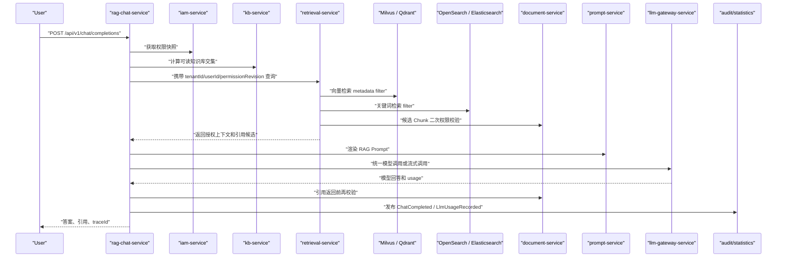
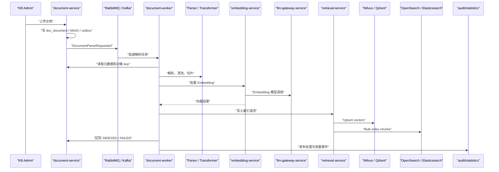
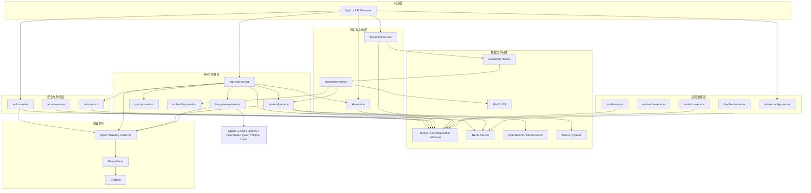

# 文档信息

- 文档名称：MICROSERVICE_DESIGN.md
- 当前状态：已合并 / 已废弃为主入口
- 最近更新阶段：system-architect 合并设计入口
- 最近更新原因：微服务演进主口径已合并进入 `02_design/DESIGN.md`，本文仅保留历史追溯，不再作为主设计入口

# 已合并 / 废弃说明

`MICROSERVICE_DESIGN.md` 已完成迁移，不再作为后续设计主入口。后续总体设计只读取：

- `02_design/DESIGN.md`

本文正文保留上一轮微服务拆分设计的历史材料，其中部分段落仍包含旧口径，例如第一阶段独立 `tenant-service`、独立 `iam-service`。这些历史段落不得作为当前实施依据。

当前有效主口径已迁移到 `02_design/DESIGN.md`：

- MVP / 第一阶段：模块化单体实现主线。
- 生产演进：C 方案，绞杀者式渐进拆分。
- 第一阶段微服务拆分只先拆 `auth-service` 和 `audit-service`。
- 第一阶段不单独拆 `tenant-service`，不单独拆 `iam-service`。
- 租户、用户、部门、角色、权限、权限快照、租户配置、租户配额、服务间鉴权先合并进 `auth-service`。
- 后续当 IAM / tenant 能力复杂化、需要独立团队维护或被多个系统复用时，再从 `auth-service` 拆出独立 `iam-service` 或 `tenant-service`。
- RAG 问答链路、文档处理链路、管理后台链路、Outbox、幂等、缓存、索引归属、禁止跨库查询等关键约束均以 `DESIGN.md` 第 16 节为准。

# 0. Workflow Orchestrator 任务识别

## 0.0 本轮修订覆盖说明

本文件是上一轮微服务拆分设计基础文档，已被合并进入 `02_design/DESIGN.md`。本节仅作为历史修订说明。

后续设计和计划主入口分别为：

- 设计主入口：`02_design/DESIGN.md`
- 计划主入口：`03_plan/TODO.md`

当前有效口径：

- 第一阶段只先拆 `auth-service` 和 `audit-service`。
- `auth-service` 合并认证、租户、用户、部门、角色、权限、权限快照、租户配置、租户配额和服务间鉴权。
- 后续当 IAM / tenant 能力复杂化、需要独立团队维护或被多个系统复用时，再从 `auth-service` 中拆出独立 `iam-service` 或 `tenant-service`。
- RAG 问答权限链路固定为 `rag-chat-service -> auth-service(permission snapshot / readable scope) -> retrieval-service -> vector/search -> rerank -> prompt-service -> llm-gateway-service`。
- 文档上传权限链路固定为 `document-service -> auth-service(check KB/document permission) -> MQ -> document-worker -> parser -> chunk -> embedding -> vector/search`。
- 管理后台权限链路固定为 `admin-config-service -> auth-service(api permission / data scope) -> target service`。

## 0.1 任务识别结果

- 任务类型：L4 高风险架构设计补充。
- 当前任务归属：`enterprise_rag_platform_design`。
- 所属能力域：认证、租户、IAM、知识库、文档处理、Embedding、检索、RAG 问答、LLM Gateway、Prompt、反馈、评估、审计、统计、后台配置。
- 是否跨模块：是，涉及 16 个生产级服务边界。
- 是否涉及高风险项：是，涉及架构调整、接口协议、数据模型、权限链路、AI 推理链路、跨服务一致性和部署架构。
- 复杂度分层：L4。
- 当前主流程：`design-researcher -> system-architect -> api-designer -> data-designer -> task-planner`。
- 本轮不进入：`spec-driven-coder`、`test-writer`、业务代码实现、Maven 测试。

## 0.2 已读取材料与规则门禁

本轮已经按 AI Rules Compliance Gate 读取并引用：

- `AGENTS.md`
- `.ai_rules/README.md`
- `.ai_rules/API_STYLE.md`
- `.ai_rules/DB_STYLE.md`
- `.ai_rules/CODING_STYLE.md`
- `.ai_rules/PROJECT_STRUCTURE.md`
- `.ai_rules/SERVICE_STYLE.md`
- `.ai_rules/COMMENT_STYLE.md`
- `.ai_rules/LOGGING_STYLE.md`
- `ai_workspace/PROJECT_REGISTRY.md`
- `00_meta/STATUS.md`
- `00_meta/CURRENT_FOCUS.md`
- `02_design/DESIGN_RESEARCH.md`
- `02_design/DESIGN.md`
- `02_design/API_SPEC.md`
- `02_design/DATA_MODEL.md`
- `03_plan/TODO.md`
- `01_requirement/REQUIREMENT.md`
- `01_requirement/CLARIFICATION.md`
- `02_design/PROMPT_SPEC.md`

规则约束落实：

- API：服务外部接口继续使用 `/api/v1/`，内部服务间接口使用 `/internal/v1/`，均使用 DTO 和统一错误语义。
- DB：微服务按服务独立 schema 设计，表字段继续使用 snake_case、`tenant_id`、状态、审计字段、软删除和乐观锁。
- 分层：每个 Java 微服务内部仍按 `controller / service / service.impl / dao.entity / dao.mapper / dto.req / dto.res / dto.common` 分层。
- Service：服务内保持 interface + impl；跨服务调用通过 OpenFeign / REST 客户端或事件，不允许直接跨库查询。
- 日志：所有同步调用、MQ 事件、模型调用、索引调用都必须携带 `traceId`、`tenantId`、`userId`、`operation`、`bizId`、`costMs`。
- 安全：RAG 问答服务不能绕过权限服务；业务服务不能直接调用模型供应商 API；服务间不能跨库直接查询。

# 1. Design Research Gate：为什么从模块化单体演进到微服务

## 1.1 不为了微服务而微服务

既有 `DESIGN_RESEARCH.md` 的推荐结论是：MVP 采用模块化单体，生产阶段按能力拆分。这个结论仍成立。微服务不是第一天的默认目标，而是在出现真实扩展压力、组织边界和 SLA 边界时的演进结果。

模块化单体仍适合：

- 单人或小团队 8 周 MVP。
- 功能闭环尚未稳定，RAG 策略、权限模型和文档处理质量还在快速变化。
- 部署资源有限，不希望被服务治理、链路追踪、配置中心、分布式一致性拖慢。
- 业务 QPS、文档量、租户数量未达到独立扩容阈值。

必须向微服务演进的触发条件：

- 文档解析、Embedding、索引构建占用 CPU / 内存，影响在线问答。
- LLM 调用耗时长且成本治理复杂，需要统一模型网关被多个业务复用。
- 检索 QPS 高，需要独立扩容 Milvus / Qdrant、OpenSearch / Elasticsearch 和 Rerank 资源。
- 权限、租户、用户体系需要对接企业 SSO / LDAP / OAuth2，并被其他系统复用。
- 审计、Token 用量、统计数据增长快，影响在线交易库。
- 团队规模扩大，需要按 IAM、知识库、文档处理、检索、模型网关、问答运营分工。
- 不同能力有不同发布节奏和 SLA，例如在线问答要高可用，文档 Worker 可异步重试。

## 1.2 方案候选

### 方案 A：保持模块化单体

- 改动范围：继续在单个 Spring Boot 应用中按包隔离能力。
- 优点：实现快、调试简单、本地部署成本低、事务简单。
- 缺点：资源隔离不足，文档处理和在线问答互相影响；模型治理和检索扩展受单体发布节奏限制。
- 风险：系统规模上来后再拆，若内部接口没有抽象好，会出现大量跨模块耦合。
- 迁移成本：低到中等，取决于现有模块边界质量。
- 测试成本：中等，以单体集成测试为主。

### 方案 B：一次性全量微服务化

- 改动范围：从第一天拆出全部 16 个服务、独立 schema、服务注册、配置、网关、监控和 CI/CD。
- 优点：生产形态完整，资源隔离好，团队边界清晰。
- 缺点：初始复杂度极高，服务联调、契约测试、链路追踪和分布式一致性成本会压过 RAG 核心能力建设。
- 风险：在业务规则未稳定前提前固化服务边界，后续反复迁移。
- 迁移成本：低，但初始建设成本高。
- 测试成本：高，需要契约测试、端到端测试、故障注入和压测。

### 方案 C：绞杀者式渐进拆分

- 改动范围：先把模块化单体中的边界抽象为内部接口，再按基础设施与权限、文档处理、检索问答、模型网关、审计统计分阶段拆服务。
- 优点：保留 MVP 速度，又能逐步获得资源隔离、独立扩容和团队协作优势。
- 缺点：过渡期会同时存在单体模块和新服务，需要网关、路由、双写或事件同步策略。
- 风险：如果过渡期缺少架构门禁，可能形成“半单体半微服务”的双重复杂度。
- 迁移成本：中等，可按服务逐步迁移。
- 测试成本：中高，需要模块内测试、服务契约测试和跨服务链路测试。

## 1.3 推荐方案

推荐方案 C：绞杀者式渐进拆分。

选择理由：

1. 与既有设计一致：MVP 模块化单体，生产按能力拆分。
2. 权限、租户、审计、模型网关属于平台基础能力，适合先抽出稳定服务边界。
3. 文档处理、Embedding、索引构建天然是异步任务，最适合优先拆出 Worker。
4. 检索服务和 RAG 问答服务有不同资源模型：检索重 CPU / 内存 / 索引，问答重在线 SLA 和流式输出。
5. LLM Gateway 必须统一承载模型路由、限流、熔断、API Key 加密、Token 和成本，不应散落在业务服务。

不采用方案 B 作为第一阶段：一次性全量拆分会把工程重心从 RAG 效果、权限防越权、文档质量和模型治理转移到服务治理本身。

不采用方案 A 作为生产终态：长期单体无法很好隔离文档处理和在线问答资源，也不利于模型网关、检索、审计统计等能力复用。

## 1.4 风险反证与回退

以下情况证明推荐方案需要调整：

- 服务拆分后跨服务调用成为主要延迟瓶颈，且 QPS 不高：应合并低频服务或退回模块化单体部署。
- IAM、KB、Document 权限边界频繁变化，导致接口契约不稳定：应先冻结权限模型和资源 ACL，再继续拆分。
- 团队不足以维护多服务 CI/CD、观测和故障响应：应只拆 `document-worker` 和 `llm-gateway-service`，其他服务保持单体。
- 文档量小、在线 QPS 低、无多团队协作：可继续使用模块化单体，把微服务设计作为生产演进路线。

回退策略：

- 服务拆分初期保留模块化单体接口适配层，允许将某个服务重新以内嵌模块方式部署。
- 所有跨服务 API 通过 DTO 契约管理，避免服务直接依赖对方 Entity。
- 所有异步事件使用 Outbox 和幂等消费，服务回退时可由单体订阅同一事件。
- 数据库从“同实例独立 schema”起步，避免第一阶段就跨多个 MySQL 集群导致运维复杂。

# 2. 微服务拆分原则

## 2.1 业务边界

- 一个服务只拥有一个清晰业务能力域。
- 服务对外暴露业务能力，而不是暴露内部表结构。
- 在线问答、文档处理、检索、模型调用、审计统计必须分清职责。
- RAG 问答服务负责编排，不负责解析文档、生成向量、直接访问模型供应商或维护用户权限。

## 2.2 数据边界

- 每个服务拥有自己的 schema 或数据库。
- 服务只能访问自己的数据库。
- 跨服务获取数据必须通过 API、事件或只读投影，禁止跨 schema join 和跨服务直接查库。
- 允许第一阶段共用同一个 MySQL 8.0 实例，但必须使用独立 schema 和独立数据库账号。
- 搜索索引、向量索引、对象存储也必须明确归属，不允许多个服务随意写同一索引。

## 2.3 权限边界

- `auth-service` 负责认证和 Token。
- `tenant-service` 负责租户状态、配额和租户配置。
- `iam-service` 负责用户、部门、角色、权限点、数据范围和权限快照。
- 业务服务不得自行拼接用户权限 SQL。
- RAG 问答必须先拿到权限快照和可见知识库范围，再调用检索服务。
- 检索服务必须执行 metadata filter 和候选 Chunk 二次校验，不得相信客户端传入的 `knowledgeBaseIds`。

## 2.4 调用频率

- 高频在线链路优先保持短链路：`rag-chat-service -> iam-service(permission snapshot) -> retrieval-service -> prompt-service -> llm-gateway-service`。
- 低频后台链路可拆得更细，例如管理配置、评估任务、统计报表。
- 文档处理链路必须异步化，避免上传请求等待解析、Embedding 和索引完成。

## 2.5 扩展压力

- `document-worker` 按队列积压和 CPU / 内存扩容。
- `embedding-service` 按模型调用并发、Token 批量和供应商限流扩容。
- `retrieval-service` 按检索 QPS、Milvus / Qdrant 和 OpenSearch 负载扩容。
- `rag-chat-service` 按在线会话、SSE 连接数和首 Token SLA 扩容。
- `llm-gateway-service` 按模型调用吞吐、供应商配额和成本统计扩容。
- `audit-service`、`statistics-service` 按日志和用量数据增长扩容。

## 2.6 团队边界

建议团队边界：

- 平台基础团队：`auth-service`、`tenant-service`、`iam-service`、`audit-service`、`statistics-service`、`admin-config-service`。
- 知识处理团队：`kb-service`、`document-service`、`document-worker`。
- AI 检索团队：`embedding-service`、`retrieval-service`、`prompt-service`、`evaluation-service`。
- 在线问答团队：`rag-chat-service`、`feedback-service`。
- 模型平台团队：`llm-gateway-service`。

# 3. 推荐服务清单

| 服务 | 领域 | 是否第一批拆分 | 拆分理由 |
| --- | --- | --- | --- |
| `auth-service` | 认证与 Token | 是 | 所有入口依赖，安全边界明确 |
| `tenant-service` | 租户与配额 | 是 | 多租户隔离和成本控制基础 |
| `iam-service` | 用户、部门、角色、权限 | 是 | RAG 防越权的基础服务 |
| `kb-service` | 知识库元数据与 ACL | 第二批 | 权限基础完成后拆 |
| `document-service` | 文档元数据、上传、状态 | 第二批 | 与文档 Worker 解耦 |
| `document-worker` | 解析、清洗、切片、索引任务 | 第二批 | 异步重负载，最适合独立扩容 |
| `embedding-service` | Embedding 批处理 | 第三批 | 受模型限流和资源消耗影响 |
| `retrieval-service` | 混合检索、Rerank、权限过滤 | 第三批 | 在线高频且资源敏感 |
| `rag-chat-service` | 会话、问答编排、SSE | 第四批 | 需要检索、Prompt、LLM Gateway 稳定后拆 |
| `llm-gateway-service` | 模型路由、供应商适配、成本 | 第三批 | 禁止业务服务直连模型供应商 |
| `prompt-service` | Prompt 模板、版本、渲染 | 第三批 | 支撑 Chat 和评估，避免硬编码 |
| `feedback-service` | 用户反馈 | 第四批 | 依赖会话和消息 |
| `evaluation-service` | 评测集和自动评分 | 第四批 | 质量运营独立迭代 |
| `audit-service` | 审计事件 | 第一批 | 安全链路基础能力 |
| `statistics-service` | Token、成本、质量统计 | 第四批 | 数据量增长快，可异步聚合 |
| `admin-config-service` | 后台配置聚合 | 第四批 | 聚合管理入口，不拥有核心业务真相 |

# 4. 服务职责矩阵

## 4.1 `auth-service`

- 职责：登录认证、Token 签发、Token 刷新、退出登录、Token 撤销、服务间认证凭证校验。
- 不负责：用户资料维护、角色授权、租户配额、业务权限判断、知识库 ACL。
- 核心表：`auth_user_credential`、`auth_refresh_token`、`auth_login_log`、`auth_service_credential`。
- 核心 API：`POST /api/v1/auth/login`、`POST /api/v1/auth/token/refresh`、`POST /api/v1/auth/logout`、`POST /internal/v1/auth/tokens/introspect`。
- 依赖服务：`tenant-service` 校验租户状态；`iam-service` 获取用户状态、角色摘要和权限版本。
- 事件：发布 `AuthLoginSucceeded`、`AuthLoginFailed`、`TokenRevoked`。
- 数据库归属：`rag_auth` schema。
- 缓存归属：Redis `auth:token:blacklist:{jti}`、`auth:login:fail:{tenantId}:{username}`。
- 权限要求：登录接口公开但限流；刷新和退出需要有效 Refresh Token；内部 introspect 仅服务间调用。
- 日志指标：登录成功/失败、密码错误次数、Token 刷新次数、认证 P95、被撤销 Token 命中次数。
- 测试要点：禁用租户禁止登录、禁用用户禁止登录、密码错误限流、Token 不入日志、服务间调用鉴权。

## 4.2 `tenant-service`

- 职责：租户生命周期、租户状态、租户配额、默认模型策略、存储和 Token 预算、租户级配置。
- 不负责：用户认证、角色授权、文档处理、模型真实调用。
- 核心表：`tenant`、`tenant_config`、`tenant_quota`、`tenant_quota_usage`。
- 核心 API：`GET /internal/v1/tenants/{tenantId}/availability`、`GET /internal/v1/tenants/{tenantId}/config`、`POST /api/v1/tenants`、`PUT /api/v1/tenants/{tenantId}/status`。
- 依赖服务：`audit-service` 记录租户配置变更；`statistics-service` 读取用量聚合。
- 事件：发布 `TenantCreated`、`TenantDisabled`、`TenantQuotaChanged`、`TenantConfigChanged`。
- 数据库归属：`rag_tenant` schema。
- 缓存归属：Redis `tenant:config:{tenantId}`、`tenant:availability:{tenantId}`。
- 权限要求：平台管理员管理租户；业务服务只读租户可用性和配额。
- 日志指标：租户状态变更、配额超限、配置变更、租户配置缓存命中率。
- 测试要点：禁用租户阻断所有业务、配额超限降级模型调用、配置变更发布事件。

## 4.3 `iam-service`

- 职责：用户、部门、角色、权限点、菜单权限、API 权限、数据权限、权限快照、权限版本。
- 不负责：密码校验、Token 签发、知识库正文、文档解析、模型调用。
- 核心表：`iam_user`、`iam_dept`、`iam_role`、`iam_user_role`、`iam_permission`、`iam_role_permission`、`iam_data_scope`、`iam_permission_snapshot`。
- 核心 API：`GET /internal/v1/iam/users/{userId}/principal`、`POST /internal/v1/iam/permissions/check`、`GET /internal/v1/iam/permissions/snapshots/{userId}`、`GET /api/v1/iam/menus`。
- 依赖服务：`tenant-service` 校验租户；`audit-service` 记录授权变更。
- 事件：发布 `UserDisabled`、`RolePermissionChanged`、`DataScopeChanged`、`PermissionSnapshotChanged`。
- 数据库归属：`rag_iam` schema。
- 缓存归属：Redis `iam:principal:{tenantId}:{userId}`、`iam:permission_snapshot:{tenantId}:{userId}:{revision}`。
- 权限要求：所有业务服务通过 IAM 获取权限快照；禁止业务服务直接查询 IAM schema。
- 日志指标：权限检查次数、拒绝次数、权限快照版本、缓存命中率、跨租户拒绝次数。
- 测试要点：API 权限 403、数据范围收缩、权限版本失效、权限异常默认拒绝。

## 4.4 `kb-service`

- 职责：知识库元数据、知识库分类、知识库状态、知识库级 ACL、知识库检索配置。
- 不负责：文档原文存储、文档解析、Chunk 生成、模型调用、会话问答。
- 核心表：`kb_knowledge_base`、`kb_category`、`kb_permission`、`kb_retrieval_config`。
- 核心 API：`GET /api/v1/knowledge-bases`、`POST /api/v1/knowledge-bases`、`PUT /api/v1/knowledge-bases/{knowledgeBaseId}`、`POST /internal/v1/knowledge-bases/permissions/check`、`POST /internal/v1/knowledge-bases/readable-ids`。
- 依赖服务：`iam-service` 获取用户权限快照；`tenant-service` 读取租户默认配置；`audit-service` 记录授权变更。
- 事件：发布 `KnowledgeBaseCreated`、`KnowledgeBaseUpdated`、`KnowledgeBasePermissionChanged`、`KnowledgeBaseDisabled`。
- 数据库归属：`rag_kb` schema。
- 缓存归属：Redis `kb:readable:{tenantId}:{userId}:{permissionRevision}`、`kb:config:{knowledgeBaseId}`。
- 权限要求：KB READ / WRITE / ADMIN；授权变更必须触发权限缓存和检索缓存失效。
- 日志指标：知识库创建、权限变更、可读 KB 计算耗时、KB 缓存命中率。
- 测试要点：普通用户只看到授权 KB、KB 权限撤销后检索不可见、管理员变更写审计。

## 4.5 `document-service`

- 职责：文档上传入口、文档元数据、文档版本、文档状态机、文档 ACL、MinIO 对象归属、重试和重建索引请求。
- 不负责：解析、切片、Embedding、向量写入、关键词索引写入、问答生成。
- 核心表：`doc_document`、`doc_permission`、`doc_processing_task`、`doc_outbox_event`。
- 核心 API：`POST /api/v1/documents/upload`、`GET /api/v1/documents/{documentId}/status`、`DELETE /api/v1/documents/{documentId}`、`POST /api/v1/documents/{documentId}/reindex`、`POST /internal/v1/documents/permissions/check`。
- 依赖服务：`kb-service` 校验知识库 WRITE / READ；`iam-service` 获取权限快照；`audit-service` 记录高风险操作。
- 事件：发布 `DocumentUploaded`、`DocumentParseRequested`、`DocumentDeleted`、`DocumentReindexRequested`、`DocumentPermissionChanged`。
- 数据库归属：`rag_document` schema。
- 缓存归属：Redis `doc:status:{documentId}`、`doc:permission:{tenantId}:{documentId}:{revision}`。
- 权限要求：上传、删除、重建索引必须有 KB WRITE / ADMIN；查询状态需要 READ；下载原文需要文档 READ。
- 日志指标：上传数量、失败数量、状态流转、MinIO 写入耗时、文档权限拒绝次数。
- 测试要点：上传幂等、MinIO 成功 DB 失败补偿、状态机非法流转拒绝、私有文档不可被普通 KB 用户读取。

## 4.6 `document-worker`

- 职责：消费文档任务、读取 MinIO、解析文件、清洗正文、Chunk 切分、调用 Embedding、写向量库和搜索索引、回写文档状态。
- 不负责：接收用户上传、用户权限配置、在线问答、模型 Chat 调用。
- 核心表：`worker_task`、`worker_task_attempt`、`worker_consume_log`；Chunk 正文可由 `document-service` schema 通过 API 写入或由独立 `rag_document_worker` schema 管理处理过程快照。
- 核心 API：`POST /internal/v1/document-worker/tasks/{taskId}/retry`、`GET /internal/v1/document-worker/tasks/{taskId}`；主要入口为 MQ 消费。
- 依赖服务：`document-service` 获取文档元数据和回写状态；`embedding-service` 获取向量；`retrieval-service` 或索引适配器写 OpenSearch / Vector Store。
- 事件：消费 `DocumentParseRequested`，发布 `DocumentParsed`、`ChunksReady`、`DocumentIndexSucceeded`、`DocumentIndexFailed`。
- 数据库归属：`rag_document_worker` schema。
- 缓存归属：Redis `worker:task:lock:{taskId}`、`worker:progress:{taskId}`。
- 权限要求：服务间凭证；异步消息携带最小安全上下文，不携带用户 Token 明文。
- 日志指标：任务积压、解析耗时、Chunk 数、Embedding batch 耗时、索引成功率、重试次数、死信数量。
- 测试要点：重复消息幂等、解析失败可重试、Worker 崩溃后任务可恢复、Chunk / 向量 / 搜索索引数量一致。

## 4.7 `embedding-service`

- 职责：Embedding 批处理、Embedding 模型路由、批量限流、向量维度校验、Embedding Token 用量记录。
- 不负责：文档解析、向量检索、Chat 生成、Prompt 渲染。
- 核心表：`embedding_job`、`embedding_job_item`、`embedding_model_route`。
- 核心 API：`POST /internal/v1/embeddings/batch`、`GET /internal/v1/embeddings/jobs/{jobId}`。
- 依赖服务：`llm-gateway-service` 调用供应商 Embedding；`tenant-service` 获取配额和默认模型；`statistics-service` 接收用量事件。
- 事件：发布 `EmbeddingRequested`、`EmbeddingCompleted`、`EmbeddingFailed`、`EmbeddingUsageRecorded`。
- 数据库归属：`rag_embedding` schema。
- 缓存归属：Redis `embedding:rate_limit:{tenantId}:{modelCode}`、`embedding:dedupe:{contentHash}`。
- 权限要求：只允许内部服务调用；按租户预算和模型配额限流。
- 日志指标：batchSize、Token 数、供应商耗时、失败率、重试率、成本。
- 测试要点：相同内容哈希幂等、供应商限流退避、维度不匹配拒绝写入、Token 用量事件准确。

## 4.8 `retrieval-service`

- 职责：权限前置过滤、向量检索、关键词检索、混合召回、Rerank、候选 Chunk 二次权限校验、引用候选生成。
- 不负责：会话管理、Prompt 渲染、模型 Chat 调用、文档解析。
- 核心表：`retrieval_config`、`retrieval_trace`、`retrieval_cache_index`；向量数据在 Milvus / Qdrant，关键词索引在 OpenSearch / Elasticsearch。
- 核心 API：`POST /internal/v1/retrieval/query`、`POST /internal/v1/retrieval/chunks/verify-permission`、`POST /internal/v1/retrieval/indexes/rebuild`。
- 依赖服务：`iam-service` 获取权限快照；`kb-service` 获取可读 KB；`document-service` 校验文档 / Chunk 权限；`embedding-service` 查询 query embedding；`llm-gateway-service` 可用于 Rerank。
- 事件：消费 `ChunksReady` 或索引事件，发布 `RetrievalExecuted`、`IndexSyncFailed`。
- 数据库归属：`rag_retrieval` schema。
- 缓存归属：Redis `retrieval:cache:{tenantId}:{queryHash}:{permissionRevision}:{configHash}`。
- 权限要求：必须以服务端 SecurityContext / TenantContext 构造权限过滤条件；权限服务异常默认拒绝。
- 日志指标：召回数量、filteredCount、vectorCostMs、keywordCostMs、rerankCostMs、P95、缓存命中率、越权候选数量。
- 测试要点：跨租户 Chunk 不可召回、私有文档不可进入 Prompt、权限撤销后缓存失效、Rerank 不可用时降级到混合分数排序。

## 4.9 `rag-chat-service`

- 职责：会话、消息、Query Rewrite 编排、问答链路编排、SSE 流式输出、引用落库、回答状态机。
- 不负责：权限数据维护、文档解析、向量检索实现、模型供应商调用、Prompt 模板存储。
- 核心表：`chat_session`、`chat_message`、`chat_citation`、`chat_context_summary`。
- 核心 API：`POST /api/v1/chat/completions`、`POST /api/v1/chat/completions/stream`、`GET /api/v1/chat/sessions`、`GET /api/v1/chat/sessions/{sessionId}`。
- 依赖服务：`iam-service` 权限快照；`retrieval-service` 获取授权上下文；`prompt-service` 渲染 Prompt；`llm-gateway-service` Chat / Stream Chat；`statistics-service` 接收 Token 用量；`audit-service` 审计问答。
- 事件：发布 `ChatMessageCreated`、`ChatCompleted`、`ChatFailed`、`CitationCreated`、`RagRefused`。
- 数据库归属：`rag_chat` schema。
- 缓存归属：Redis `chat:session_summary:{sessionId}`、`chat:sse:buffer:{messageId}`、`chat:hot_question:{cacheKey}`。
- 权限要求：每次问答重新校验会话归属、KB READ 权限、引用权限；禁止复用过期权限结论。
- 日志指标：首 Token 耗时、总回答耗时、拒答率、引用数量、用户中断率、低置信率。
- 测试要点：RAG 问答必须先调用权限再调用检索；无授权上下文拒答；客户端断开标记 CANCELED；模型失败保留错误状态。

## 4.10 `llm-gateway-service`

- 职责：模型配置读取、供应商适配、API Key 解密、Chat / Embedding / Rerank 调用、流式协议统一、超时、重试、熔断、降级、限流、Token 和成本记录。
- 不负责：业务权限判断、文档处理、RAG 检索、Prompt 模板业务配置。
- 核心表：`llm_model_config`、`llm_provider_config`、`llm_api_key`、`llm_route_policy`、`llm_token_usage_raw`、`llm_circuit_breaker_state`。
- 核心 API：`POST /internal/v1/llm/chat`、`POST /internal/v1/llm/chat/stream`、`POST /internal/v1/llm/embeddings`、`POST /internal/v1/llm/rerank`、`POST /api/v1/models/test-connection`。
- 依赖服务：`tenant-service` 获取租户策略；`statistics-service` 聚合用量；`audit-service` 记录 Key 和模型配置变更；`admin-config-service` 提供管理入口。
- 事件：发布 `LlmCallSucceeded`、`LlmCallFailed`、`LlmUsageRecorded`、`ModelRouteDegraded`。
- 数据库归属：`rag_llm_gateway` schema。
- 缓存归属：Redis `llm:model_config:{tenantId}:{modelCode}`、`llm:rate_limit:{tenantId}:{modelCode}`、`llm:circuit:{provider}:{modelCode}`。
- 权限要求：只允许内部业务服务调用；管理 API 仅平台管理员或租户管理员；API Key 不返回明文。
- 日志指标：provider、modelCode、operationType、promptTokens、completionTokens、costAmount、timeout、retry、fallback、costMs。
- 测试要点：业务服务无供应商 SDK 依赖、API Key 脱敏、429 重试、供应商失败切备用、Token 成本 decimal 精度。

## 4.11 `prompt-service`

- 职责：Prompt 模板、变量契约、版本、灰度、回滚、渲染、Prompt Injection 规则和 Golden Case 绑定。
- 不负责：模型真实调用、会话存储、权限数据维护。
- 核心表：`prompt_template`、`prompt_template_version`、`prompt_variable_contract`、`prompt_release_record`、`prompt_eval_binding`。
- 核心 API：`POST /internal/v1/prompts/render`、`GET /internal/v1/prompts/active`、`POST /api/v1/prompt-templates`、`POST /api/v1/prompt-templates/{id}/publish`、`POST /api/v1/prompt-templates/{id}/rollback`。
- 依赖服务：`iam-service` 管理权限；`audit-service` 审计版本变更；`evaluation-service` 绑定评测集。
- 事件：发布 `PromptTemplatePublished`、`PromptTemplateRolledBack`、`PromptVariableChanged`。
- 数据库归属：`rag_prompt` schema。
- 缓存归属：Redis `prompt:active:{tenantId}:{scenario}`、`prompt:rendered:hash:{hash}`。
- 权限要求：普通用户不可读取系统 Prompt 细节；管理操作需要 Prompt 管理权限。
- 日志指标：模板命中、渲染耗时、变量校验失败、回滚次数、Prompt Injection 拒答命中。
- 测试要点：变量缺失拒绝发布、历史版本不可覆盖、错误 Prompt 可回滚、普通用户不可获取模板正文。

## 4.12 `feedback-service`

- 职责：点赞、点踩、评分、原因标签、用户反馈、反馈处理状态。
- 不负责：问答生成、引用校验、评测集维护。
- 核心表：`qa_feedback`、`qa_feedback_tag`、`qa_feedback_process_log`。
- 核心 API：`POST /api/v1/feedback`、`GET /api/v1/feedback`、`PUT /api/v1/feedback/{feedbackId}/status`。
- 依赖服务：`rag-chat-service` 校验消息可见性；`iam-service` 校验处理权限；`audit-service` 记录处理动作。
- 事件：发布 `FeedbackCreated`、`FeedbackResolved`、`FeedbackMarkedAsEvaluationCandidate`。
- 数据库归属：`rag_feedback` schema。
- 缓存归属：Redis `feedback:duplicate:{messageId}:{userId}`。
- 权限要求：用户只能反馈自己可见的消息；运营人员只能处理授权范围内反馈。
- 日志指标：反馈数量、差评率、原因标签分布、处理时长。
- 测试要点：越权反馈拒绝、重复反馈幂等、反馈评论脱敏、处理状态合法。

## 4.13 `evaluation-service`

- 职责：评测集、Golden Case、回归 Case、评测任务、答案评分、引用准确性评分、Prompt / 检索策略评估。
- 不负责：在线用户问答、模型配置管理、文档解析。
- 核心表：`eval_dataset`、`eval_case`、`eval_run`、`eval_run_item`、`eval_score_result`。
- 核心 API：`POST /api/v1/evaluation/datasets`、`POST /api/v1/evaluation/runs`、`GET /api/v1/evaluation/runs/{runId}`、`POST /internal/v1/evaluation/cases/import`。
- 依赖服务：`rag-chat-service` 执行非流式评测问答；`prompt-service` 获取 Prompt 版本；`statistics-service` 接收质量指标。
- 事件：发布 `EvaluationRunStarted`、`EvaluationRunCompleted`、`EvaluationCaseFailed`。
- 数据库归属：`rag_evaluation` schema。
- 缓存归属：Redis `evaluation:run:progress:{runId}`。
- 权限要求：评测数据按租户隔离；敏感样本脱敏；运营 / 质检角色管理。
- 日志指标：通过率、引用准确率、拒答准确率、Prompt Injection 防护通过率、评测成本。
- 测试要点：评测样本跨租户隔离、评分规则稳定、模型评分不稳定时人工复核、成本记录准确。

## 4.14 `audit-service`

- 职责：审计事件接收、审计日志落库、权限拒绝、配置变更、文档高风险操作、模型 Key 操作记录。
- 不负责：实时业务判权、报表聚合、普通业务数据维护。
- 核心表：`audit_log`、`audit_event_inbox`、`audit_archive_task`。
- 核心 API：`POST /internal/v1/audit/events`、`GET /api/v1/audit/logs`。
- 依赖服务：`iam-service` 查询审计查看权限；`tenant-service` 校验租户。
- 事件：消费所有 `AuditEvent`；发布 `AuditLogArchived`。
- 数据库归属：`rag_audit` schema。
- 缓存归属：Redis `audit:rate_limit:{tenantId}`；审计一般不依赖缓存做真相判断。
- 权限要求：审计查询严格按平台管理员、租户管理员、审计员范围控制；审计写入只允许内部服务。
- 日志指标：审计事件吞吐、积压、失败重试、归档量、越权拒绝次数。
- 测试要点：审计事件至少一次写入、重复事件幂等、敏感字段脱敏、审计查询不能跨租户。

## 4.15 `statistics-service`

- 职责：Token 用量、成本、调用次数、满意度、检索质量、文档处理成功率、日 / 月聚合报表。
- 不负责：模型真实调用、审计真相日志、权限授权配置。
- 核心表：`stat_token_usage_daily`、`stat_cost_daily`、`stat_retrieval_quality_daily`、`stat_feedback_daily`、`stat_document_processing_daily`。
- 核心 API：`GET /api/v1/statistics/token-usage`、`GET /api/v1/statistics/cost`、`GET /api/v1/statistics/rag-quality`。
- 依赖服务：`tenant-service` 获取预算；`iam-service` 控制统计范围；`llm-gateway-service`、`feedback-service`、`evaluation-service` 提供事件。
- 事件：消费 `LlmUsageRecorded`、`FeedbackCreated`、`RetrievalExecuted`、`DocumentIndexSucceeded`。
- 数据库归属：`rag_statistics` schema。
- 缓存归属：Redis `statistics:dashboard:{tenantId}:{date}`。
- 权限要求：普通用户查自己；租户管理员查本租户；平台管理员查平台聚合。
- 日志指标：聚合延迟、消费积压、报表查询耗时、预算接近阈值告警。
- 测试要点：decimal 成本精度、重复事件幂等聚合、跨租户统计隔离、预算告警准确。

## 4.16 `admin-config-service`

- 职责：后台配置聚合入口、模型配置管理 UI 后端、Prompt 管理入口、知识库管理入口、租户配置聚合。
- 不负责：拥有核心业务真相表；不直接绕过领域服务修改底层数据。
- 核心表：`admin_operation_log`、`admin_config_view`；核心配置真相仍由对应服务拥有。
- 核心 API：`GET /api/v1/admin/dashboard`、`POST /api/v1/admin/models`、`POST /api/v1/admin/prompts`、`GET /api/v1/admin/knowledge-bases`。
- 依赖服务：`tenant-service`、`iam-service`、`kb-service`、`prompt-service`、`llm-gateway-service`、`statistics-service`、`audit-service`。
- 事件：发布 `AdminOperationRequested`；高风险操作以领域服务事件为准。
- 数据库归属：`rag_admin_config` schema，只保存后台操作视图和偏好。
- 缓存归属：Redis `admin:dashboard:{tenantId}`。
- 权限要求：后台所有操作必须先经过 IAM API 权限和数据范围校验。
- 日志指标：后台操作次数、配置变更失败率、聚合查询耗时。
- 测试要点：后台不能直接改其他服务 DB、普通用户 403、高风险配置变更写审计。

# 5. 服务间调用方式

## 5.1 同步 REST / OpenFeign

适用场景：

- 在线问答链路中的权限快照、检索、Prompt 渲染、LLM Gateway 调用。
- 管理后台查询当前状态。
- 文档上传时校验 KB 权限和租户配额。

约束：

- 所有内部接口使用 `/internal/v1/`，并通过服务间鉴权。
- Feign Client 只能依赖 DTO，不依赖对方 Entity。
- 每个调用必须配置超时、重试策略和熔断策略。
- 禁止同步链路无限级联；在线 RAG 问答链路最多保留必要依赖。

建议超时：

| 调用 | 建议超时 | 重试 |
| --- | --- | --- |
| IAM 权限快照 | 300ms-800ms | 只读可短重试 1 次 |
| KB / Document 权限检查 | 300ms-800ms | 只读可短重试 1 次 |
| Retrieval 查询 | 800ms-1500ms | 不建议业务层重复重试 |
| Prompt 渲染 | 300ms-800ms | 可重试 1 次 |
| LLM Chat 非流式 | 30s-60s | 由 LLM Gateway 内部处理 |
| LLM Stream | 建立连接 5s，整体按模型策略 | 不在 Chat 服务重试生成 |

## 5.2 异步 MQ / Kafka

适用场景：

- 文档解析、Chunk、Embedding、索引构建。
- 审计日志、统计聚合、用量记录。
- 权限变更后的缓存失效和索引权限版本刷新。
- 评测任务批量执行。

RabbitMQ 起步，Kafka 用于生产事件流：

- RabbitMQ：任务队列、重试、死信、低中吞吐。
- Kafka：高吞吐事件、统计聚合、审计流、搜索索引事件。

## 5.3 事件驱动

事件命名原则：

- 使用过去式：`DocumentUploaded`、`ChunksReady`、`LlmUsageRecorded`。
- 事件只表达事实，不包含下游处理指令。
- 事件必须包含 `eventId`、`eventType`、`tenantId`、`traceId`、`occurredAt`、`producerService`、`schemaVersion`。

核心事件：

| 事件 | 生产者 | 消费者 |
| --- | --- | --- |
| `TenantDisabled` | tenant-service | auth、iam、kb、document、chat |
| `PermissionSnapshotChanged` | iam-service | kb、retrieval、chat |
| `KnowledgeBasePermissionChanged` | kb-service | retrieval、chat |
| `DocumentUploaded` | document-service | document-worker、audit |
| `DocumentParseRequested` | document-service | document-worker |
| `ChunksReady` | document-worker | embedding、retrieval |
| `EmbeddingCompleted` | embedding-service | retrieval、statistics |
| `DocumentIndexSucceeded` | document-worker | document、statistics |
| `ChatCompleted` | rag-chat-service | statistics、feedback、audit |
| `LlmUsageRecorded` | llm-gateway-service | statistics、audit |
| `FeedbackCreated` | feedback-service | statistics、evaluation |

## 5.4 Outbox、幂等、重试、超时、熔断

Outbox：

- 每个写事件的服务在本地事务内写业务表和 `outbox_event`。
- Outbox Dispatcher 异步投递 MQ / Kafka。
- 投递成功后标记 `PUBLISHED`，失败按指数退避重试。

幂等：

- 所有消费方维护 `event_consume_log(event_id, consumer_service)`。
- 文档任务使用 `tenantId + documentId + documentVersion + taskType` 做幂等键。
- Embedding 使用 `contentHash + modelCode + dimension` 做幂等键。
- API 写接口支持 `Idempotency-Key`。

重试：

- 只对网络超时、临时 429、下游 503 做有限重试。
- 不对权限拒绝、参数错误、状态冲突做重试。
- Worker 失败进入死信队列并记录人工处理入口。

熔断：

- 按 `service + method` 维度统计内部调用失败率。
- LLM Gateway 按 `provider + modelCode + operationType` 熔断。
- Retrieval 对 Rerank 熔断后退回混合召回排序。

# 6. 数据库拆分策略

## 6.1 推荐策略

第一阶段：同一个 MySQL 8.0 实例，独立 schema，独立账号。

```text
mysql-rag
├── rag_auth
├── rag_tenant
├── rag_iam
├── rag_kb
├── rag_document
├── rag_document_worker
├── rag_embedding
├── rag_retrieval
├── rag_chat
├── rag_llm_gateway
├── rag_prompt
├── rag_feedback
├── rag_evaluation
├── rag_audit
├── rag_statistics
└── rag_admin_config
```

第二阶段：高增长和高负载服务独立数据库实例：

- `rag_audit`、`rag_statistics` 独立实例或分区归档。
- `rag_chat` 独立实例承载在线会话。
- `rag_document` 和 `rag_document_worker` 独立实例，避免解析任务影响在线查询。
- `rag_llm_gateway` 独立实例，便于模型成本和调用审计治理。

强约束：

- 禁止跨服务直接查库。
- 禁止跨 schema join。
- 禁止业务服务读取其他服务的 Entity 或 Mapper。
- 需要跨服务数据时，通过 API、事件、只读投影或缓存快照解决。

## 6.2 表归属

| 表 / 数据 | 归属服务 | 说明 |
| --- | --- | --- |
| `auth_user_credential`、`auth_refresh_token`、`auth_login_log` | auth-service | 认证与 Token 真相 |
| `tenant`、`tenant_config`、`tenant_quota` | tenant-service | 租户与配额真相 |
| `iam_user`、`iam_dept`、`iam_role`、`iam_permission`、`iam_data_scope` | iam-service | 身份、组织和权限真相 |
| `kb_knowledge_base`、`kb_permission`、`kb_retrieval_config` | kb-service | 知识库元数据与 KB ACL |
| `doc_document`、`doc_permission`、`doc_processing_task` | document-service | 文档元数据、状态和文档 ACL |
| `worker_task`、`worker_task_attempt` | document-worker | Worker 执行状态 |
| `embedding_job`、`embedding_job_item` | embedding-service | Embedding 批处理状态 |
| `retrieval_config`、`retrieval_trace` | retrieval-service | 检索配置和检索跟踪 |
| Milvus / Qdrant collection | retrieval-service | 向量索引归属 |
| OpenSearch / Elasticsearch index | retrieval-service | 关键词索引归属 |
| `chat_session`、`chat_message`、`chat_citation` | rag-chat-service | 会话、消息和引用 |
| `llm_model_config`、`llm_api_key`、`llm_token_usage_raw` | llm-gateway-service | 模型配置、密钥和原始用量 |
| `prompt_template`、`prompt_template_version` | prompt-service | Prompt 版本真相 |
| `qa_feedback` | feedback-service | 用户反馈真相 |
| `eval_dataset`、`eval_case`、`eval_run` | evaluation-service | 评测真相 |
| `audit_log` | audit-service | 审计真相 |
| `stat_*` 聚合表 | statistics-service | 报表聚合真相 |
| `admin_operation_log` | admin-config-service | 后台聚合操作日志 |

## 6.3 共享库过渡边界

允许：

- 同实例独立 schema，统一备份和监控。
- 只读投影表，例如 `retrieval_visible_chunk_projection`，由事件同步生成。
- API Gateway 或 admin 聚合层调用多个服务 API 组装视图。

禁止：

- `rag-chat-service` 直接查 `rag_document.doc_chunk`。
- `retrieval-service` 直接查 `rag_iam.iam_role`。
- `admin-config-service` 直接修改 `rag_llm_gateway.llm_model_config`。
- Worker 直接更新 `rag_chat.chat_citation`。

# 7. 权限链路设计

## 7.1 JWT 与 SecurityContext

JWT Claims 建议：

```json
{
  "tenantId": 1,
  "userId": 10001,
  "deptId": 20001,
  "roleIds": [10, 11],
  "tokenVersion": 3,
  "permissionRevision": 18,
  "jti": "uuid",
  "exp": 1893456000
}
```

处理流程：

1. API Gateway / 服务 Filter 校验 Bearer Token 签名、过期时间和撤销状态。
2. `auth-service` 或本地公钥校验 Token，必要时 introspect。
3. 每个服务创建本地 `SecurityContext` 和 `TenantContext`。
4. 服务内部只读取上下文中的 `tenantId`、`userId`、`roleIds` 和 `permissionRevision`，不允许客户端覆盖。
5. 高风险接口再调用 `iam-service` 二次校验权限。

## 7.2 TenantContext

- 所有入口请求必须从 Token 或服务间签名头中解析 `tenantId`。
- 平台管理员跨租户操作必须使用专门 API，并写审计。
- MQ 事件必须携带 `tenantId` 和 `traceId`。
- 异步线程使用 TaskDecorator 传递 MDC，但不能长期持有用户敏感信息。

## 7.3 用户权限快照

权限快照包含：

- API 权限码。
- 菜单 / 按钮权限。
- 数据范围。
- 可读知识库 ID 摘要。
- 权限版本 `permissionRevision`。

使用方式：

- 登录时返回最小权限摘要。
- 在线问答前 `rag-chat-service` 调用 `iam-service` 获取最新权限快照。
- `retrieval-service` 基于 `permissionRevision` 构造缓存 key。
- 权限变更发布 `PermissionSnapshotChanged`，使 chat、retrieval、kb 缓存失效。

## 7.4 服务间鉴权

服务间调用必须具备两类身份：

- 用户委托身份：转发当前用户的 `tenantId/userId/traceId/permissionRevision`，用于用户操作链路。
- 服务身份：mTLS、内部 JWT 或签名请求头，证明调用方服务可信。

禁止：

- 在日志中打印原始 Authorization。
- Worker 使用用户 Access Token 调下游。
- 下游服务只凭传入 `userId` 信任调用方。

## 7.5 权限异常默认拒绝

以下情况必须拒绝或降级为拒答：

- IAM 不可用且没有可用权限快照。
- 权限快照版本过期且无法刷新。
- KB / Document ACL 校验超时。
- 检索候选无法完成二次权限校验。

# 8. RAG 问答跨服务链路

## 8.1 链路步骤

用户要求的简化链路口径：

```text
chat -> permission -> retrieval -> vector/search -> rerank -> prompt -> llm-gateway
```

```text
rag-chat-service
-> iam-service(permission snapshot)
-> kb-service(readable knowledge bases)
-> retrieval-service
-> Milvus / Qdrant + OpenSearch / Elasticsearch
-> rerank capability
-> document-service(chunk/document permission verify)
-> prompt-service
-> llm-gateway-service
-> model provider
-> rag-chat-service save answer/citations
-> audit/statistics/feedback events
```

强约束：

- `rag-chat-service` 不能绕过 `iam-service` 和资源权限校验。
- `retrieval-service` 不能只信任 chat 传来的 KB ID，必须独立校验权限快照和候选 Chunk。
- `rag-chat-service` 不能直接调用模型供应商 API，只能调用 `llm-gateway-service`。
- Prompt 渲染必须来自 `prompt-service`，不能把 Prompt 硬编码进 Chat Service。

## 8.2 Mermaid 链路图



# 9. 文档处理跨服务链路

## 9.1 链路步骤

用户要求的简化链路口径：

```text
kb/document -> MQ -> document-worker -> parser -> chunk -> embedding -> vector/search
```

```text
kb-service / document-service
-> MQ / Kafka
-> document-worker
-> parser adapter
-> clean transformer
-> chunk strategy
-> embedding-service
-> llm-gateway-service(embedding provider)
-> retrieval-service index writer
-> Milvus / Qdrant + OpenSearch / Elasticsearch
-> document-service status update
-> audit/statistics events
```

## 9.2 Mermaid 链路图



# 10. 微服务下的数据一致性

## 10.1 文档状态一致性

文档状态机：

```text
UPLOADED
-> PARSE_QUEUED
-> PARSING
-> PARSED
-> EMBEDDING
-> INDEXING
-> INDEXED
-> FAILED
-> DELETED
```

规则：

- 状态推进由 `document-service` 持有真相。
- `document-worker` 只能通过内部 API 回写状态，不能直接改 `document-service` DB。
- 每次状态变更带 `expectedStatus` 和 `version`，防止乱序消息覆盖新状态。
- 删除文档时先把文档置为不可见，再异步删除向量和搜索索引。

## 10.2 Chunk、向量库、OpenSearch 一致性

一致性主键：

```text
tenantId + documentId + documentVersion + chunkNo
```

要求：

- Chunk 生成后先有 DB 或处理快照，再写向量和关键词索引。
- Vector ID 和 Search Doc ID 必须可反查 Chunk。
- 向量库和搜索索引写入成功后，才允许文档进入 `INDEXED`。
- 写入部分失败时进入 `FAILED`，保留重试任务。
- 定时一致性巡检比较 DB Chunk 数、Vector 数、Search Index 数。

## 10.3 引用一致性

- `chat_citation` 保存引用快照：文档名、页码、quote 摘要、chunkId、documentVersion。
- 引用展示前重新调用 `document-service` 校验权限。
- 文档删除后历史引用可显示快照，但下载原文必须拒绝或提示文档不可用。
- 权限收紧后历史会话的引用详情需按当前权限过滤。

## 10.4 Token 与成本一致性

- 原始 Token 用量由 `llm-gateway-service` 记录为真相。
- `statistics-service` 只消费事件做聚合，不直接计算供应商原始调用。
- 供应商未返回 Token 时，Gateway 估算并标记 `estimated=true`。
- 成本使用 decimal，禁止 float/double。

## 10.5 审计一致性

- 高风险操作的业务表变更和 Outbox 审计事件同事务写入。
- `audit-service` 至少一次消费，按 `eventId` 幂等。
- 审计写失败不能阻塞所有低风险业务，但必须告警；高风险配置变更可要求审计确认后才返回成功。

## 10.6 权限与缓存一致性

- 权限变更生成新的 `permissionRevision`。
- Chat 和 Retrieval 缓存 key 必须包含 `permissionRevision`。
- 权限事件丢失时，缓存 TTL 兜底过期。
- 权限服务异常默认拒绝，不使用过期权限扩大访问范围。

# 11. 部署架构

## 11.1 生产部署建议

```text
Internet / Intranet
-> Nginx / API Gateway
-> auth / tenant / iam
-> kb / document / rag-chat / admin-config
-> document-worker / embedding / retrieval / prompt / llm-gateway
-> MySQL schemas / Redis / MinIO / RabbitMQ-Kafka / OpenSearch / Milvus-Qdrant
-> audit / statistics / evaluation
-> Prometheus / Grafana / OpenTelemetry
```

## 11.2 Mermaid 部署图



# 12. API 设计补充

## 12.1 外部 API 与内部 API

- 外部 API：继续遵守既有 `API_SPEC.md`，统一 `/api/v1/`。
- 内部 API：服务间调用使用 `/internal/v1/`，仅允许内网、mTLS 或内部 JWT 访问。
- 所有 API 响应包含 `traceId`；内部 API 也要返回清晰错误码。
- 创建、上传、重建索引、评测任务等写接口必须支持幂等。

## 12.2 核心内部 API

| 服务 | API | 用途 |
| --- | --- | --- |
| auth-service | `POST /internal/v1/auth/tokens/introspect` | Token 校验和撤销检查 |
| tenant-service | `GET /internal/v1/tenants/{tenantId}/availability` | 租户可用性和配额校验 |
| iam-service | `GET /internal/v1/iam/permissions/snapshots/{userId}` | 获取权限快照 |
| iam-service | `POST /internal/v1/iam/permissions/check` | API / 数据权限检查 |
| kb-service | `POST /internal/v1/knowledge-bases/readable-ids` | 计算可读知识库 |
| kb-service | `POST /internal/v1/knowledge-bases/permissions/check` | KB READ / WRITE / ADMIN 校验 |
| document-service | `POST /internal/v1/documents/permissions/check` | 文档和 Chunk 权限校验 |
| document-service | `PUT /internal/v1/documents/{documentId}/status` | Worker 回写状态 |
| embedding-service | `POST /internal/v1/embeddings/batch` | 批量 Embedding |
| retrieval-service | `POST /internal/v1/retrieval/query` | 授权混合检索 |
| prompt-service | `POST /internal/v1/prompts/render` | Prompt 渲染 |
| llm-gateway-service | `POST /internal/v1/llm/chat` | 非流式模型调用 |
| llm-gateway-service | `POST /internal/v1/llm/chat/stream` | 流式模型调用 |
| audit-service | `POST /internal/v1/audit/events` | 审计事件写入 |

## 12.3 错误语义

| code | 场景 |
| --- | --- |
| `401001` | Token 无效或服务间凭证无效 |
| `403001` | 用户无 API / 数据 / KB / 文档权限 |
| `409001` | 文档状态冲突、幂等冲突 |
| `429001` | 租户、用户、模型、服务限流 |
| `502001` | 模型供应商调用失败 |
| `503001` | 下游服务不可用、熔断、降级 |
| `503101` | 权限服务不可用且无可用快照，默认拒绝 |
| `503201` | 检索服务不可用，RAG 问答拒答或降级 |

# 13. 数据模型补充

微服务拆分后，既有 `DATA_MODEL.md` 中的表需要按服务拆分或演进。以下是新增或调整重点：

| 现有 / 新增数据 | 微服务归属 | 演进说明 |
| --- | --- | --- |
| `sys_user.password_hash` | auth-service | 从 IAM 用户资料拆为 `auth_user_credential`，避免 IAM 暴露密码哈希 |
| `sys_user` | iam-service | 演进为 `iam_user`，只保存身份资料和状态 |
| `sys_role`、`sys_permission` | iam-service | 演进为 IAM 权限中心 |
| `kb_permission` | kb-service | 作为 KB ACL 真相，通过 API 暴露给权限链路 |
| `doc_permission` | document-service | 文档 ACL 真相，引用和检索二次校验依赖它 |
| `doc_chunk` | document-service / retrieval projection | 原文 Chunk 真相归 document，retrieval 保存索引投影 |
| `llm_token_usage` | llm-gateway-service + statistics projection | Gateway 保存原始用量，statistics 保存聚合 |
| `audit_log` | audit-service | 不再由各业务服务直接写审计库 |
| `outbox_event` | 每个写服务 | 每个服务本地 outbox，避免分布式事务 |
| `event_consume_log` | 每个消费者 | 消费幂等记录 |

数据库设计原则：

- MySQL 8.0 仍是关系数据主库。
- 向量检索仍使用 Milvus / Qdrant，不使用 PostgreSQL + pgvector 作为主方案。
- 关键词索引仍使用 OpenSearch / Elasticsearch。
- 认证仍基于 Spring Security，不采用 Sa-Token 主方案。
- AI 编排继续使用 Spring AI 和自研 LLM Gateway，不采用 LangChain4j 主方案。

# 14. 从当前单体 TODO 演进到微服务 TODO 的阶段计划

当前 `03_plan/TODO.md` 是模块化单体 MVP 实施计划。微服务演进不应推翻它，而应在它完成边界抽象后分阶段迁移。

## MS-PHASE-0：冻结模块边界和契约

- 来源：当前 TODO TASK-001 到 TASK-004。
- 目标：保留 `com.lnzz.rag` 模块边界，先把服务接口、DTO、异常、traceId、日志、基础设施抽象做扎实。
- 验收：单体内禁止 Controller 直连 Mapper；LLM Gateway interface 存在；PermissionService interface 存在。
- 不做：不拆服务、不改数据库实例、不引入跨服务事务。

## MS-PHASE-1：先拆权限和基础设施

- 拆分服务：`auth-service`、`tenant-service`、`iam-service`、`audit-service`。
- 来源：当前 TODO TASK-010 到 TASK-019。
- 目标：把登录认证、租户、用户、角色、权限、数据范围、审计基础拆成稳定平台能力。
- 验收：RAG Chat、Document、KB 均只能通过 IAM / KB / Document API 做权限判断，不能直接查权限库。
- 风险：权限拆分不稳定会影响所有服务；必须先完成契约测试。

## MS-PHASE-2：拆知识库与文档入口

- 拆分服务：`kb-service`、`document-service`。
- 来源：当前 TODO TASK-020 到 TASK-029。
- 目标：知识库元数据、KB ACL、文档元数据、文档 ACL、上传和状态机独立。
- 验收：上传文档只等待 MinIO + DB + Outbox，不等待解析；文档状态通过内部 API 回写。
- 风险：KB ACL 和文档 ACL 需要与 IAM 快照版本一致。

## MS-PHASE-3：拆文档处理 Worker

- 拆分服务：`document-worker`、`embedding-service`。
- 来源：当前 TODO TASK-030 到 TASK-036 和 TASK-040 到 TASK-047 中的 Embedding 能力。
- 目标：解析、清洗、切片、Embedding、索引构建异步化和独立扩容。
- 验收：Worker 消费 `DocumentParseRequested`，幂等处理，失败可重试，状态准确回写。
- 风险：Chunk、向量、OpenSearch 三方一致性；必须有巡检和补偿。

## MS-PHASE-4：拆模型网关和 Prompt

- 拆分服务：`llm-gateway-service`、`prompt-service`。
- 来源：当前 TODO TASK-040 到 TASK-047、TASK-058。
- 目标：业务服务不再拥有供应商 SDK、API Key、价格计算、Prompt 模板正文。
- 验收：代码静态检查业务服务不依赖模型供应商包；Prompt 可版本化和回滚。
- 风险：LLM Gateway 不可用会影响 Chat、Embedding、Rerank；必须有主备模型和降级策略。

## MS-PHASE-5：拆检索与问答

- 拆分服务：`retrieval-service`、`rag-chat-service`。
- 来源：当前 TODO TASK-050 到 TASK-062。
- 目标：检索和问答分别扩容；Chat 只负责编排和会话，Retrieval 负责授权召回和二次权限校验。
- 验收：链路固定为 `chat -> permission -> retrieval -> vector/search -> rerank -> prompt -> llm-gateway`。
- 风险：跨服务延迟增加；必须用缓存、并行检索和超时预算控制。

## MS-PHASE-6：拆反馈、评估、统计与后台配置

- 拆分服务：`feedback-service`、`evaluation-service`、`statistics-service`、`admin-config-service`。
- 来源：当前 TODO TASK-070 到 TASK-087。
- 目标：质量运营和后台管理独立迭代，统计聚合不影响在线问答。
- 验收：反馈、评测、统计均按租户隔离；后台配置不直接改其他服务 DB。
- 风险：聚合服务可能出现最终一致性延迟，报表需标明统计时间。

# 15. 架构约束验证清单

必须持续验证：

- `rag-chat-service` 没有直接调用模型供应商 SDK。
- `rag-chat-service` 每次问答先获取权限快照，再调用检索服务。
- `retrieval-service` 检索前构造权限 filter，检索后调用文档 / Chunk 权限二次校验。
- `document-worker` 不直接处理用户上传 HTTP 请求。
- `llm-gateway-service` 是唯一解密 API Key 的服务。
- `admin-config-service` 不跨库修改领域服务数据。
- 服务间 DTO 不暴露数据库 Entity。
- 所有服务日志不打印 Token、API Key、密码、完整个人敏感信息。
- 所有服务数据库账号只允许访问自身 schema。
- 所有异步事件有 `eventId` 和消费幂等记录。

# 16. 当前结论

本轮微服务拆分设计通过 Design Research Gate、Design Gate、API/Data 设计补充和 Plan Gate。

最终建议：

- MVP 和学习阶段继续以当前模块化单体 TODO 为实现主线。
- 生产级演进采用绞杀者式渐进拆分。
- 第一批必须拆权限和基础设施：`auth-service`、`tenant-service`、`iam-service`、`audit-service`。
- 第二批拆文档处理：`kb-service`、`document-service`、`document-worker`。
- 第三批拆模型和检索：`llm-gateway-service`、`prompt-service`、`embedding-service`、`retrieval-service`。
- 第四批拆在线问答和运营：`rag-chat-service`、`feedback-service`、`evaluation-service`、`statistics-service`、`admin-config-service`。

本轮仍为纯设计文档任务，未编写业务代码，未执行 Maven 单元测试，不能声明软件可运行或可发布。
